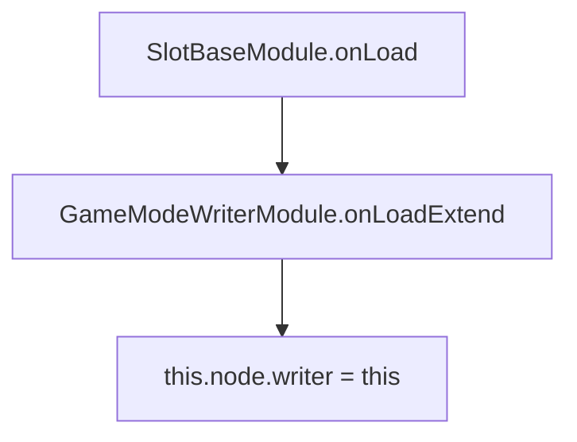

# `GameModeWriterModule.onLoadExtend(): void`

<!-- convention-summary-start -->
### GameModeWriterModule.onLoadExtend() Method Specification Summary

- **Core Architecture / Purpose**: Technical reference, API contract, and integration guide for GameModeWriterModule.onLoadExtend() Method Specification.
- **Key Mechanisms & Design**: Encapsulates core algorithms, event hooks, and performance optimizations within the slot framework runtime.
- **Domain Capabilities**: cc_slot_module, 05_methods
- **Scope & Code Paths**: `assets/cc-common/cc-slot-module/`
- **Related Docs**: [Master Index](../INDEX.md)
<!-- convention-summary-end -->


---

## 1. Method Signature
```typescript
public onLoadExtend(): void
```

---

## 2. Trigger Source & Lifecycle
* **Invoker**: Called by `SlotBaseModule.onLoad()` during component initialization.
* **Timing**: Executed when the game mode writer component awakens in the Cocos scene tree.
* **Purpose**: Registers this writer instance onto its parent node's `writer` property (`this.node["writer"] = this`) so companion director modules and directors can resolve it directly.

---

## 3. Detailed Algorithmic Execution Logic
1. **Binds Writer Reference**: Sets `this.node["writer"] = this`, allowing `GameModeDirectorModule` to access this writer instance via `this.node["writer"]` or `this.getComponent(GameModeWriterModule)`.

---

## 4. Caller & Callee Relationship


---

## 5. Un-truncated Source Code Implementation
```typescript
onLoadExtend(): void {
	this.node["writer"] = this;
}
```
