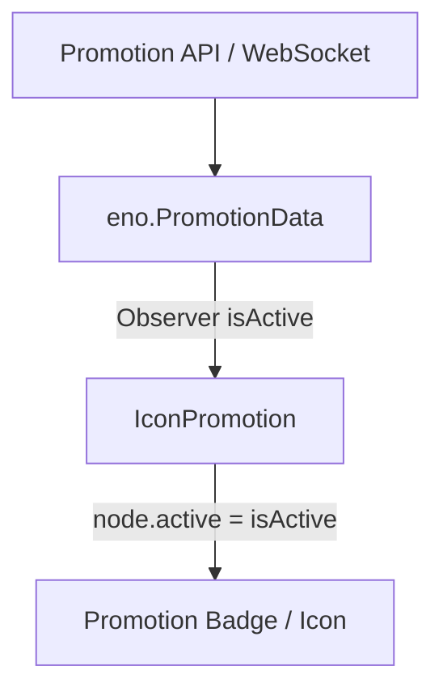

# 🏛️ IconPromotion Architectural Role & Promotional Event HUD

<!-- convention-summary-start -->
### IconPromotion Architectural Role & Promotional Event HUD Summary

- **Core Architecture / Purpose**: Technical reference, API contract, and integration guide for IconPromotion Architectural Role & Promotional Event HUD.
- **Key Mechanisms & Design**: Encapsulates core algorithms, event hooks, and performance optimizations within the slot framework runtime.
- **Domain Capabilities**: cc_slot_module, 01_overview
- **Scope & Code Paths**: `assets/cc-common/cc-slot-module/`
- **Related Docs**: [Master Index](../INDEX.md)
<!-- convention-summary-end -->

---

## 1. Architectural Mission

`IconPromotion` manages promotional badges and event icons mounted under `Canvas/Director/UIManager/Promotion`. It observes `eno.PromotionData.isActive` to dynamically display tournament / mission event tags and pairs with `SlotPromotionSpinTimes` to display free promotional round counters.

---

## 2. Key Responsibilities

1. **Promotion Visibility Control (`showPromotion`)**:
   - Observes reactive `PromotionData.isActive` and mounts/unmounts promotional badges.
2. **Complementary Countdown Display (`SlotPromotionSpinTimes`)**:
   - Renders remaining rounds for operator marketing campaigns and free tournament spins.
