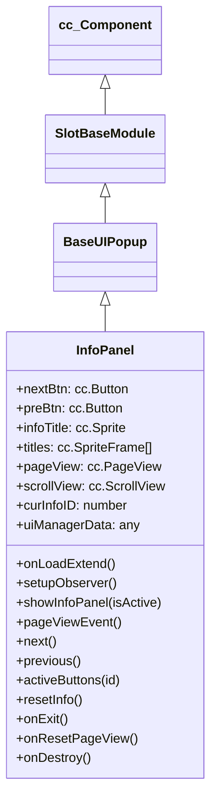

# 🏛️ InfoPanel Architecture & Role

<!-- convention-summary-start -->
### InfoPanel Architecture & Role Summary

- **Core Architecture / Purpose**: Technical reference, API contract, and integration guide for InfoPanel Architecture & Role.
- **Key Mechanisms & Design**: Encapsulates core algorithms, event hooks, and performance optimizations within the slot framework runtime.
- **Domain Capabilities**: cc_slot_module, 01_overview
- **Scope & Code Paths**: `assets/cc-common/cc-slot-module/`
- **Related Docs**: [Master Index](../INDEX.md)
<!-- convention-summary-end -->


`InfoPanel` is the in-game paytable rulebook and feature explanation modal controller in the `cc-common` Slot Framework SDK. Inheriting from `BaseUIPopup`, it supports multi-page horizontal navigation via `cc.PageView` (Landscape mode) or vertical scrolling via `cc.ScrollView` (Portrait mode), dynamic title spriteframe swapping, and boundary navigation button locking.

---

## 1. Architectural Boundaries & System Role

- **Multi-Layout Support**: Handles Landscape games using `pageView: cc.PageView` and Portrait games using `scrollView: cc.ScrollView`.
- **Dynamic Header Swapping**: Changes `infoTitle` spriteFrame dynamically based on `curInfoID` from the `titles` array.
- **PageView Reset Workaround**: Executes an scheduled active toggle (`onResetPageView`) on enable to force Cocos 2.4 PageView geometry recalibration.

---

## 2. Component Hierarchy

Canonical Node Path: `Canvas/Director/Popup/Info`

```text
Canvas/Director/Popup/Info (InfoPanel, FadePopupBehavior)
├── Header
│   ├── InfoTitle (cc.Sprite)
│   └── CloseButton (cc.Button)
├── PageView (cc.PageView - Landscape)
│   └── View/Content (cc.Node)
│       ├── Page_0 (cc.Node - Paylines & Symbol Multipliers)
│       ├── Page_1 (cc.Node - Free Spin Rules)
│       └── Page_2 (cc.Node - Feature Rules)
├── ScrollView (cc.ScrollView - Portrait fallback)
├── NavigationButtons
│   ├── PreBtn (cc.Button)
│   └── NextBtn (cc.Button)
└── PageIndicator (PageViewIndicatorModule)
```

---

## 3. Inheritance Diagram


