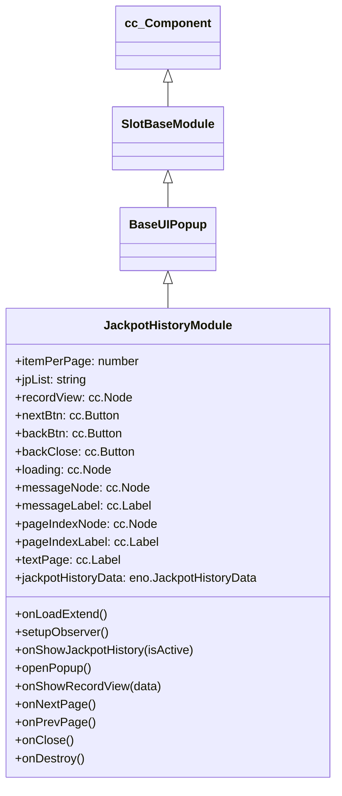

# 🏛️ JackpotHistoryModule Architecture & Role

<!-- convention-summary-start -->
### JackpotHistoryModule Architecture & Role Summary

- **Core Architecture / Purpose**: Technical reference, API contract, and integration guide for JackpotHistoryModule Architecture & Role.
- **Key Mechanisms & Design**: Encapsulates core algorithms, event hooks, and performance optimizations within the slot framework runtime.
- **Domain Capabilities**: cc_slot_module, 01_overview
- **Scope & Code Paths**: `assets/cc-common/cc-slot-module/`
- **Related Docs**: [Master Index](../INDEX.md)
<!-- convention-summary-end -->


`JackpotHistoryModule` is the dedicated popup controller for displaying recent progressive jackpot winners (Grand, Major, Minor, Mini) in the `cc-common` Slot Framework SDK. Inheriting from `BaseUIPopup`, it provides pagination, error state handling, server payload formatting, and reactive observer bindings to `JackpotHistoryData`.

---

## 1. Architectural Boundaries & System Role

- **Tier Filtering**: Configured with `jpList: "GRAND-MAJOR"` to filter server-side jackpot logs for specific jackpot tiers.
- **Reactive Model Observer**: Watches `JackpotHistoryData` for updates to `recordData`, `isShowing`, `pageIndex`, `isEnableLoading`, and `isEnableNext`/`isEnablePrev`.
- **Row Presentation Delegation**: Broadcasts `UPDATE_DATA` and `CLEAR_DATA` to the child `recordView` node to render individual winner rows.

---

## 2. Component Hierarchy

Canonical Node Path: `Canvas/Director/Popup/JackpotHistory`

```text
Canvas/Director/Popup/JackpotHistory (JackpotHistoryModule, FadePopupBehavior)
├── RecordView (cc.Node - Jackpot winner row list container)
├── Header
│   ├── Title (cc.Label / cc.Sprite)
│   └── CloseButton (cc.Button)
├── PaginationGroup
│   ├── BackBtn (cc.Button)
│   ├── NextBtn (cc.Button)
│   └── PageIndexNode (cc.Node)
│       └── PageIndexLabel (cc.Label)
├── Loading (cc.Node - Spinner)
└── MessageNode (cc.Node)
    └── MessageLabel (cc.Label)
```

---

## 3. Inheritance Diagram


