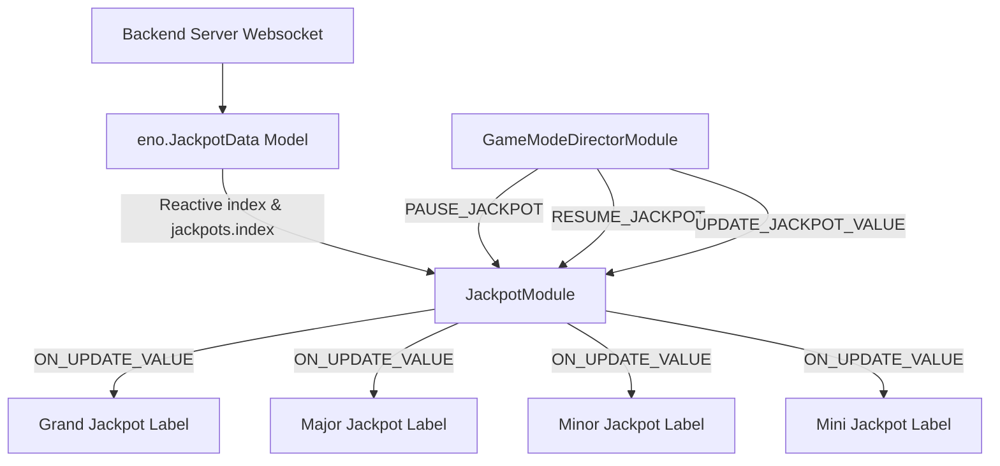

# 🏛️ JackpotModule Architectural Role & Progressive Jackpot HUD

<!-- convention-summary-start -->
### JackpotModule Architectural Role & Progressive Jackpot HUD Summary

- **Core Architecture / Purpose**: Technical reference, API contract, and integration guide for JackpotModule Architectural Role & Progressive Jackpot HUD.
- **Key Mechanisms & Design**: Encapsulates core algorithms, event hooks, and performance optimizations within the slot framework runtime.
- **Domain Capabilities**: cc_slot_module, 01_overview
- **Scope & Code Paths**: `assets/cc-common/cc-slot-module/`
- **Related Docs**: [Master Index](../INDEX.md)
<!-- convention-summary-end -->


---

## 1. Architectural Mission

`JackpotModule` manages the top progressive jackpot meters dashboard mounted under `Canvas/Director/Jackpot`. It supports multi-tier jackpots (`GRAND`, `MAJOR`, `MINOR`, `MINI`), synchronizes live server streaming feeds from `eno.JackpotData` (`jackpots[betIndex]`), orchestrates rolling number interpolation via `JackpotModuleItem` and `MoneyTween`, and enforces freeze/unfreeze lifecycle states (`PAUSE_JACKPOT` / `RESUME_JACKPOT`) when celebratory win cutscenes (`JackpotWinModule`) are active.



---

## 2. Key Responsibilities

1. **Multi-Tier Progressive Rendering (`renderAllJackpot`)**:
   - Updates Grand, Major, Minor, Mini labels using progressive count-up time ($3.0\text{s}$).
2. **Bet Denomination Sync (`setupObserver` on `index`)**:
   - Dynamically re-binds nested observers (`jackpots.${index}`) whenever the player alters their bet tier, switching immediately to the corresponding jackpot pool values.
3. **Celebration Lockout (`pauseJackpot` / `resumeJackpot`)**:
   - Freezes progressive number ticking during spin resolution and celebratory `JackpotWinModule` cutscenes.

---

## 3. Synergy with `JackpotWinModule`

While `JackpotModule` operates as the persistent HUD display meter, `JackpotWinModule` functions as the transient celebration modal triggered during jackpot payout events:

```
┌─────────────────────────────────────────────────────────────────────────────┐
│                           Jackpot Lifecycle Topology                        │
│                                                                             │
│  ┌───────────────────────────────────────────────────────────────────────┐  │
│  │                    JackpotModule (Persistent HUD)                     │  │
│  │   Renders Grand / Major / Minor / Mini meters with progressive tween  │  │
│  └──────────────────────────────────▲────────────────────────────────────┘  │
│                                     │                                       │
│  1. Jackpot Hit: Director issues PAUSE_JACKPOT to freeze HUD meter         │
│  2. Director triggers CutsceneController -> Displays JackpotWinModule       │
│                                     │                                       │
│  ┌──────────────────────────────────▼────────────────────────────────────┐  │
│  │                   JackpotWinModule (Full-Screen Modal)                │  │
│  │   Plays coin particles, 10s count-up tween, and celebration audio     │  │
│  └──────────────────────────────────┬────────────────────────────────────┘  │
│                                     │                                       │
│  3. Cutscene Exit: Director issues RESUME_JACKPOT to unfreeze HUD meter     │
└─────────────────────────────────────────────────────────────────────────────┘
```
