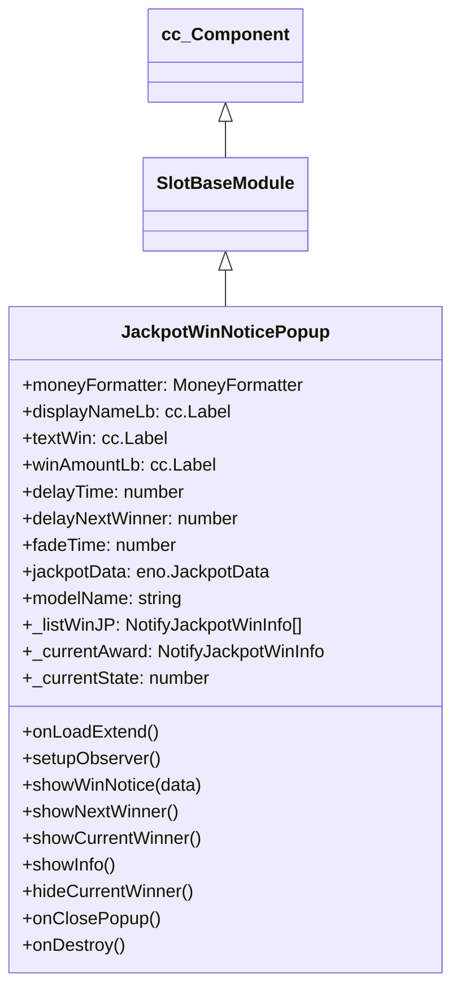

# 🏛️ JackpotWinNoticePopup Architecture & Role

<!-- convention-summary-start -->
### JackpotWinNoticePopup Architecture & Role Summary

- **Core Architecture / Purpose**: Technical reference, API contract, and integration guide for JackpotWinNoticePopup Architecture & Role.
- **Key Mechanisms & Design**: Encapsulates core algorithms, event hooks, and performance optimizations within the slot framework runtime.
- **Domain Capabilities**: cc_slot_module, 01_overview
- **Scope & Code Paths**: `assets/cc-common/cc-slot-module/`
- **Related Docs**: [Master Index](../INDEX.md)
<!-- convention-summary-end -->


`JackpotWinNoticePopup` is the global real-time jackpot broadcast banner in the `cc-common` Slot Framework SDK. Mounted directly in the scene graph, it listens reactively to `JackpotData.notifyJackpotInfo`, queues other room players who hit progressive jackpots, and presents animated fade/slide toast notifications sequentially.

---

## 1. Architectural Boundaries & System Role

- **Self-Exclusion Filter**: Automatically filters out winning notices where `displayName === userDisplayName` (since the local player receives the dedicated fullscreen `JackpotWinModule` celebration).
- **Sequential Queueing**: Stores incoming winning alerts in `_listWinJP` and displays them sequentially with configured display (`delayTime = 4s`) and interval (`delayNextWinner = 2s`) durations.
- **State Machine Transitions**: Transitions through `CLOSED (0) ➔ MOVING (1) ➔ IDLE (2) ➔ CLOSING (3)` using `cc.tween` to guarantee clean animation chaining without UI overlap.

---

## 2. Component Hierarchy

Canonical Node Path: `Canvas/Director/Popup/JackpotNotice`

```text
Canvas/Director/Popup/JackpotNotice (JackpotWinNoticePopup)
├── Background (cc.Sprite / cc.Layout)
├── DisplayNameLabel (cc.Label)
├── TextWinLabel (cc.Label - Localized "has won")
├── WinAmountLabel (cc.Label - Formatted currency amount)
└── CloseButton (Optional click-to-dismiss hit area)
```

---

## 3. Inheritance Diagram


