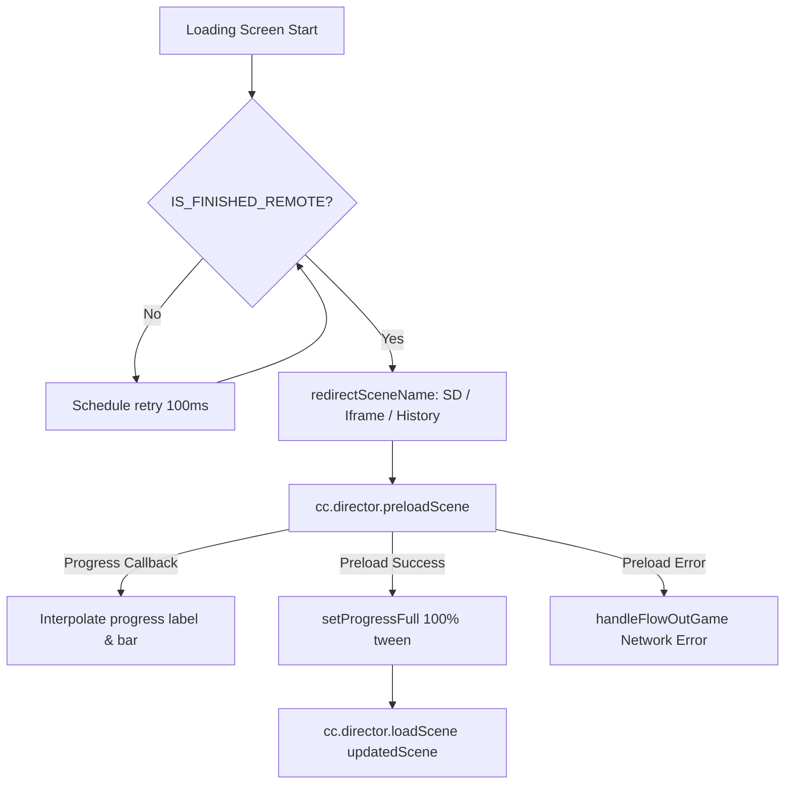

# 🏛️ LoadingScreenModule Architectural Role & Scene Preloader

<!-- convention-summary-start -->
### LoadingScreenModule Architectural Role & Scene Preloader Summary

- **Core Architecture / Purpose**: Technical reference, API contract, and integration guide for LoadingScreenModule Architectural Role & Scene Preloader.
- **Key Mechanisms & Design**: Encapsulates core algorithms, event hooks, and performance optimizations within the slot framework runtime.
- **Domain Capabilities**: cc_slot_module, 01_overview
- **Scope & Code Paths**: `assets/cc-common/cc-slot-module/`
- **Related Docs**: [Master Index](../INDEX.md)
<!-- convention-summary-end -->

---

## 1. Architectural Mission

`LoadingScreenModule` is the **Bootstrap Scene Preloader & Multi-Target Scene Router** mounted on the loading scene of all Cocos Common slot games (`Canvas/Director/Loading`). It manages:
- Async asset bundle and scene preloading via `cc.director.preloadScene`.
- Smooth progress bar interpolation with `cc.tween` easing (`sineIn`) to prevent jarring jumps.
- Multi-resolution and environment-driven scene name redirection (SD scenes for low-end mobile, IFrame wrapper modes, and Bet History replay scene redirection).
- Howler.js audio context pre-registration (`JsbUtils.registerLoadHowl()`) on web/mobile browsers.
- In-loading Home / Lobby return button with graceful iframe exit handling.

---

## 2. Key Responsibilities

1. **Multi-Target Scene Routing (`redirectSceneName`)**:
   - Parses URL search parameters (`?history=true`) to route into `sceneNameHistory`.
   - Checks `sys.isMobile` to select lower-memory `sdSceneName` (Standard Definition assets).
   - Validates existence against `cc.game._sceneInfos`.
2. **Smooth Progress Smoothing (`update`, `setProgressFull`)**:
   - Gradually catches up the visual progress bar towards the actual preload percentage (`totalPercent`) at 20 steps per second.
3. **WebAudio / Mobile Audio Initialization**:
   - Pre-initializes Howler audio context under Iframe environments to enable zero-latency audio playback upon main scene entry.
