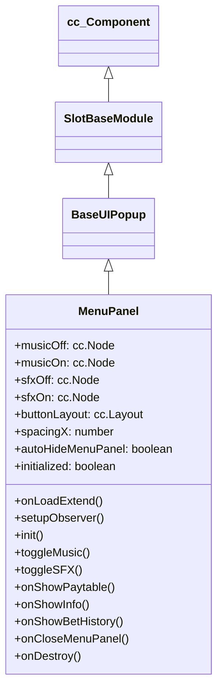

# 🏛️ MenuPanel Architecture & Role

<!-- convention-summary-start -->
### MenuPanel Architecture & Role Summary

- **Core Architecture / Purpose**: Technical reference, API contract, and integration guide for MenuPanel Architecture & Role.
- **Key Mechanisms & Design**: Encapsulates core algorithms, event hooks, and performance optimizations within the slot framework runtime.
- **Domain Capabilities**: cc_slot_module, 01_overview
- **Scope & Code Paths**: `assets/cc-common/cc-slot-module/`
- **Related Docs**: [Master Index](../INDEX.md)
<!-- convention-summary-end -->

`MenuPanel` is the mobile slide-out hamburger navigation drawer in the `cc-common` Slot Framework SDK. Inheriting from `BaseUIPopup`, it provides quick access to BGM/SFX audio toggles, Paytable (`PayTablePanel`), Game Rules (`InfoPanel`), and Bet History (`BetHistoryModule`), with automatic iframe closing and layout adaptation.

---

## 1. Architectural Role

- **Slide-out Navigation Drawer**: Manages navigation icons with `autoHideMenuPanel` support to automatically dismiss when a sub-panel opens.
- **Direct Audio Muting**: Directly toggles BGM and SFX states with instant visual icon swapping (`musicOn`/`musicOff`, `sfxOn`/`sfxOff`).
- **IFrame Environment Support**: Dynamically adjusts `buttonLayout.spacingX` when embedded inside login iframe wrappers.

---

## 2. Inheritance Diagram

