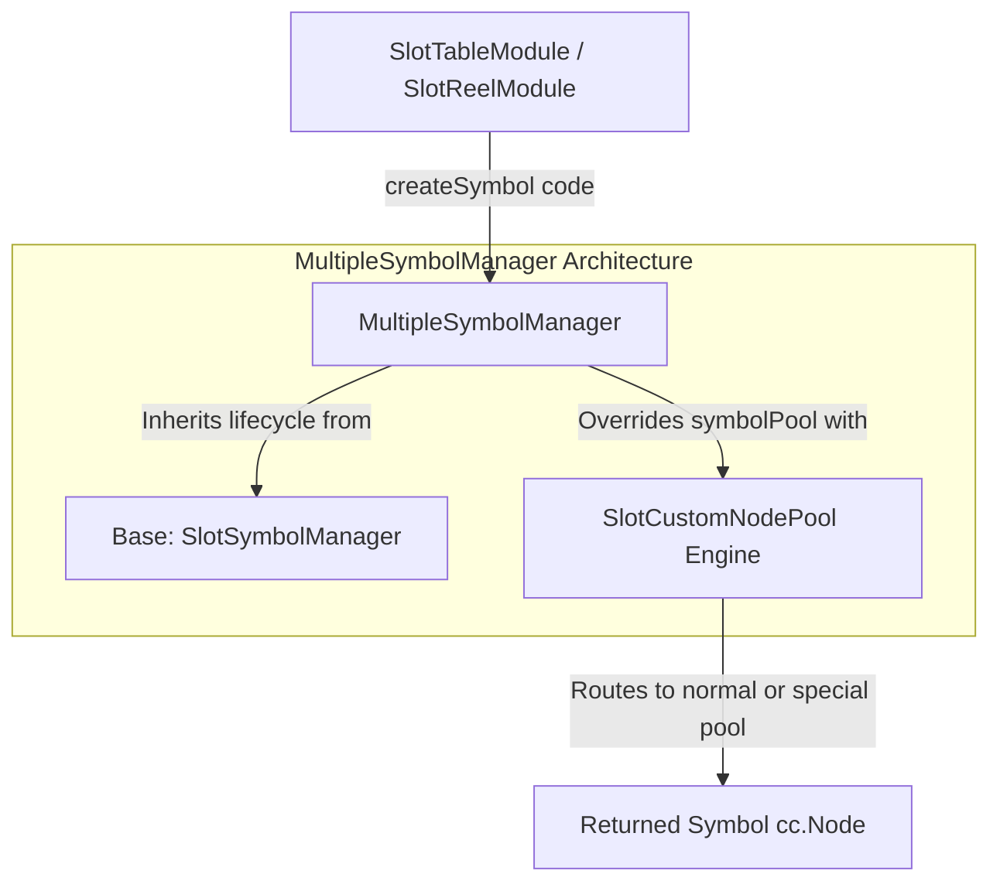

# 🎭 MultipleSymbolManager Architecture & Multi-Template Delegation

<!-- convention-summary-start -->
### MultipleSymbolManager Architecture & Multi-Template Delegation Summary

- **Core Architecture / Purpose**: Technical reference, API contract, and integration guide for MultipleSymbolManager Architecture & Multi-Template Delegation.
- **Key Mechanisms & Design**: Encapsulates core algorithms, event hooks, and performance optimizations within the slot framework runtime.
- **Domain Capabilities**: cc_slot_module, 01_overview
- **Scope & Code Paths**: `assets/cc-common/cc-slot-module/BaseModule/Table/SlotSymbol/MultipleSymbolManager.ts`
- **Related Docs**: [Master Index](../INDEX.md)
<!-- convention-summary-end -->

---

## 1. Architectural Purpose

`MultipleSymbolManager` (`assets/cc-common/cc-slot-module/BaseModule/Table/SlotSymbol/MultipleSymbolManager.ts`) is an advanced specialization of `SlotSymbolManager`.

While standard `SlotSymbolManager` allocates every symbol from a single uniform `template` prefab, `MultipleSymbolManager` overrides the pooling engine by instantiating and delegating to **`SlotCustomNodePool`**. This enables games to assign completely distinct prefab architectures for special symbols (e.g. 3D Spine Wilds, particle-emitting Scatters, Jackpot chests):

---

## 2. Core Responsibilities

1. **Inspector Template Configuration (`specialSymbolTemplates`)**: Exposes an array of `SpecialSymbolTemplates` in Cocos Creator Editor for artist/developer prefab binding.
2. **Custom Pool Initialization (`initSymbolPool`)**: Instantiates `SlotCustomNodePool` passing the base template, initial count, and special templates list.
3. **Targeted Checkout Delegation (`getSymbolFromPool`)**: Delegates `getSymbolFromPool(code)` directly to `this.symbolPool.get(code)`.
