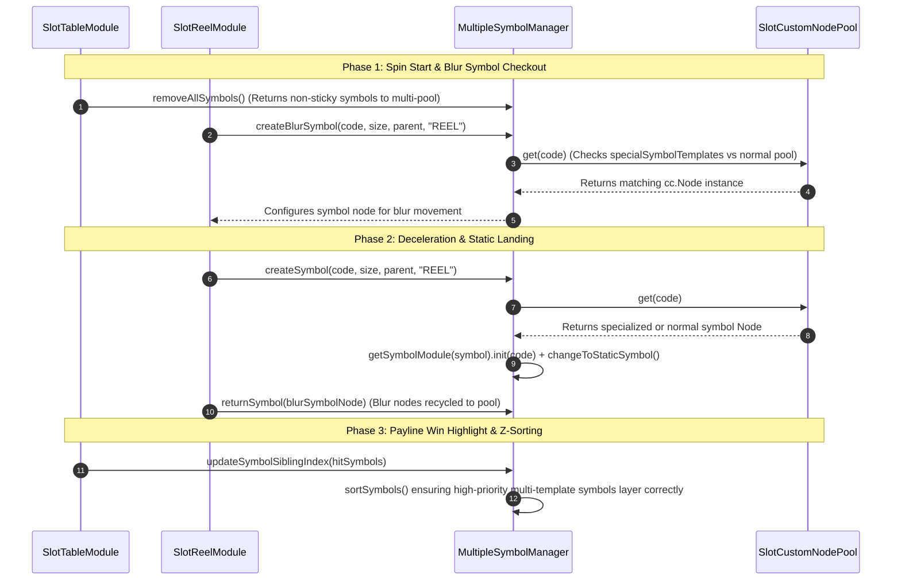

# 🌀 MultipleSymbolManager Spin Phase Multi-Pool Breakdown

<!-- convention-summary-start -->
### MultipleSymbolManager Spin Phase Multi-Pool Breakdown Summary

- **Core Architecture / Purpose**: Defines network protocol, socket packet lifecycle, state persistence, and error handling for MultipleSymbolManager Spin Phase Multi-Pool Breakdown.
- **Key Mechanisms & Design**: Handles WebSocket frame dispatch, acknowledgment confirmation, state resume, and resilient synchronization between client DataStore and Backend Gateway.
- **Domain Capabilities**: cc_slot_module, 02_game_flow
- **Scope & Code Paths**: `assets/cc-common/cc-slot-module/`
- **Related Docs**: [Master Index](../INDEX.md)
<!-- convention-summary-end -->

---

## 1. Spin Lifecycle & Multi-Template Dispatch Flow

---

## 2. Multi-Template Allocation Logic Across Spin Loop

1. **Spin Initiation (Pre-Spin Clear)**:
   - `removeAllSymbols()` reclaims all previous active symbol instances, routing them back through `returnSymbol()`.
   - Nodes are returned to their designated pool key in `SlotCustomNodePool` (`SPECIAL_SYMBOLS` vs `NORMAL_POOL_NAME`).

2. **Reel Spinning & Blur Allocation**:
   - `SlotReelModule` queries `createBlurSymbol(code)` during reel rolling.
   - `MultipleSymbolManager` queries `this.symbolPool.get(code)`. If `code` matches an item in `specialSymbolTemplates`, the dedicated Spine/Particle prefab is checked out.

3. **Matrix Landing (Stop Presentation)**:
   - Static symbols are requested using `createSymbol(code)`.
   - The corresponding symbol node is checked out and initialized with `init(code)` before being attached to the reel column.

4. **FTR & Fast Stop Abort**:
   - `resetAllEffectAndTasks()` immediately halts any running Spine animations or particle effects across both standard and special symbol instances.
