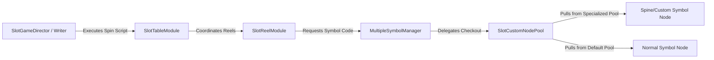

# 🎼 MultipleSymbolManager Director & Writer Pipeline Orchestration

<!-- convention-summary-start -->
### MultipleSymbolManager Director & Writer Pipeline Orchestration Summary

- **Core Architecture / Purpose**: Technical reference, API contract, and integration guide for MultipleSymbolManager Director & Writer Pipeline Orchestration.
- **Key Mechanisms & Design**: Encapsulates core algorithms, event hooks, and performance optimizations within the slot framework runtime.
- **Domain Capabilities**: cc_slot_module, 03_director_writer_integration
- **Scope & Code Paths**: `assets/cc-common/cc-slot-module/`
- **Related Docs**: [Master Index](../INDEX.md)
<!-- convention-summary-end -->

---

## 1. Interaction with Table, Reels & Custom Pool Pipeline

---

## 2. Pipeline Execution Steps

1. **Table Configuration Ingestion**:
   - During `onLoadExtend`, `SlotTableModule` propagates `gameConfig` via `setGameConfig()`, configuring priority layers for both standard and special symbols.
2. **Reel Multi-Prefab Borrowing**:
   - When `SlotReelModule` receives matrix data from Writer/Director commands (e.g. `showReelMatrix`), it calls `createSymbol(code)` on `MultipleSymbolManager`.
   - `MultipleSymbolManager` passes `code` into `SlotCustomNodePool`, retrieving the exact prefab node without `SlotReelModule` needing to know which pool supplied it.
3. **Payline Highlighting & Z-Order Sorting**:
   - `SlotTablePaylineModule` triggers `updateSymbolSiblingIndex()`, ensuring special multi-template symbols (e.g. 3D Wilds, Jackpots) stay elevated above background elements during win animations.
