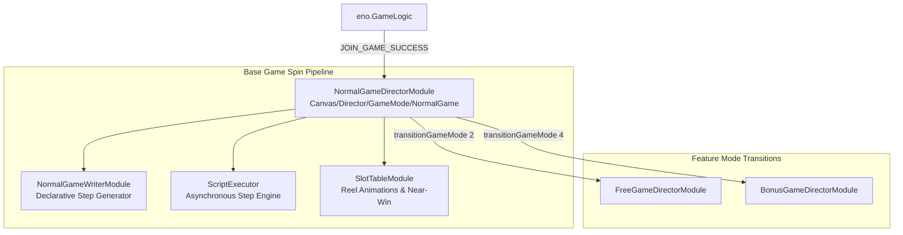

# 🏛️ NormalGameDirectorModule Base Game Orchestrator Architecture

<!-- convention-summary-start -->
### NormalGameDirectorModule Base Game Orchestrator Architecture Summary

- **Core Architecture / Purpose**: Technical reference, API contract, and integration guide for NormalGameDirectorModule Base Game Orchestrator Architecture.
- **Key Mechanisms & Design**: Encapsulates core algorithms, event hooks, and performance optimizations within the slot framework runtime.
- **Domain Capabilities**: cc_slot_module, 01_overview
- **Scope & Code Paths**: `assets/cc-common/cc-slot-module/GameMode/NormalGame/NormalGameDirectorModule.ts`
- **Related Docs**: [Master Index](../INDEX.md)
<!-- convention-summary-end -->

## 1. Executive Summary & Purpose

`NormalGameDirectorModule` (`assets/cc-common/cc-slot-module/GameMode/NormalGame/NormalGameDirectorModule.ts`) is the **Base Game Spin Loop Controller** in the `cc-common` Slot SDK.

Extending `GameModeDirectorModule`, it manages the lifecycle of the default Base Game mode (`GAME_MODE_ENUM.NORMAL_GAME`). It orchestrates initial authentication handshake events (`onJoinGameSuccess`), handles normal game spins and respins, and mediates transitions into Free Game or Bonus Game modes.

---

## 2. Core Responsibilities

1. **Authentication State Propagation**: Dispatches `JOIN_GAME_SUCCESS` event to unlock UI spin buttons after WebSocket connection.
2. **Normal Spin Flow Coordination**: Triggers `NormalSpinTrigger`, `StartSpinning`, `StopSpinningTable`, and `ShowResultFinal`.
3. **Session Reconnection Management**: Handles `onStateResume()` and pre-resume payline setups when player returns to normal game.
