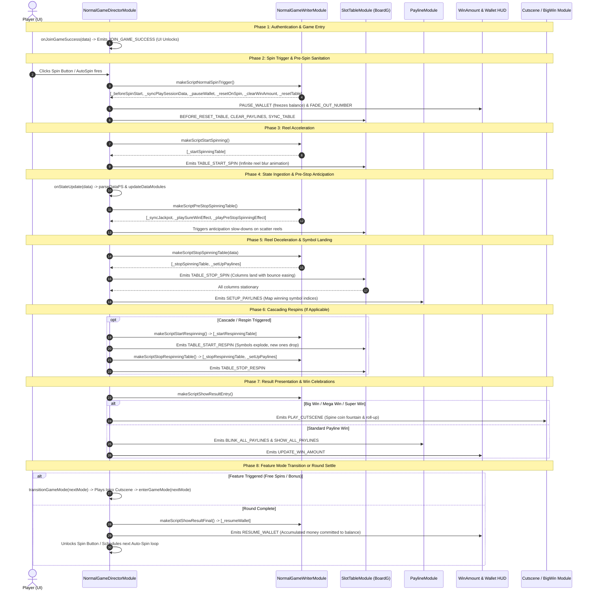

# 🌀 NormalGameDirectorModule Complete 8-Phase Base Game Spin Breakdown

<!-- convention-summary-start -->
### NormalGameDirectorModule Complete 8-Phase Base Game Spin Breakdown Summary

- **Core Architecture / Purpose**: Defines network protocol, socket packet lifecycle, state persistence, and error handling for NormalGameDirectorModule Complete 8-Phase Base Game Spin Breakdown.
- **Key Mechanisms & Design**: Handles WebSocket frame dispatch, acknowledgment confirmation, state resume, and resilient synchronization between client DataStore and Backend Gateway.
- **Domain Capabilities**: cc_slot_module, 02_game_flow
- **Scope & Code Paths**: `assets/cc-common/cc-slot-module/GameMode/NormalGame/NormalGameDirectorModule.ts`
- **Related Docs**: [Master Index](../INDEX.md)
<!-- convention-summary-end -->

## 1. Executive Game Flow Overview

In a slot title, the **Base Game (Normal Game)** is the core experience where 80%+ of player time is spent. `NormalGameDirectorModule` (`assets/cc-common/cc-slot-module/GameMode/NormalGame/NormalGameDirectorModule.ts`) inherits from `GameModeDirectorModule` to orchestrate this entire cycle, managing state transitions, reel animations, payline calculations, respin loops, and bonus mode triggers.

---

## 2. Exhaustive Step-by-Step Breakdown of All 8 Phases

### Phase 1: Authentication & Game Entry (`onJoinGameSuccess`)
1. **Trigger**: WebSocket connects and server authenticates user token.
2. **Execution**:
   * Logs debug badge: `warn("%c onJoinGameSuccess ", "color: red", data)`.
   * Emits global `GameUIEvents.GAME_MODE.JOIN_GAME_SUCCESS` with player credentials, balance, and default bet values.
   * `SlotButtonNormal` and `BetModule` enable interactive touch states.

---

### Phase 2: Spin Trigger & Pre-Spin Sanitation (`onBeforeSpinStart`)
1. **Trigger**: Player taps Spin, spaces on keyboard, or auto-spin interval ticks.
2. **Action Pipeline**: `runAction("NormalSpinTrigger")` executing:
   * `_beforeSpinStart()`: Calls `this.resetGameSpeed()` to restore configured speed (Normal vs Turbo). Invokes `this.skipAllEffects()` to clear any lingering win animations or delays. If `isAutoSpin` is active, awaits `delayAutoSpin()`.
   * `_syncPlaySessionData()`: Synchronizes win counters and credit values from previous round.
   * `_pauseWallet()`: Emits `GameUIEvents.WALLET.PAUSE_WALLET` to freeze user balance, preventing visual desync while betting deductions process.
   * `_resetOnSpin()`: Hook for clearing custom feature indicators (e.g. multipliers, sticky frames).
   * `_clearWinAmount()`: Emits `GameUIEvents.WIN_AMOUNT.FADE_OUT_NUMBER` to smoothly transition win labels to zero.
   * `_resetTable()`: Emits scoped events `BEFORE_RESET_TABLE`, `CLEAR_PAYLINES`, and `SYNC_TABLE` to ensure the symbol grid is clean.

---

### Phase 3: Reel Acceleration (`onStartSpinningTable`)
1. **Action Pipeline**: `runAction("StartSpinning")` executing:
   * `_startSpinningTable()`: Emits scoped `TABLE_START_SPIN` to `SlotTableModule`.
   * Columns begin blur motion and start looping symbol ribbons infinitely.

---

### Phase 4: State Ingestion & Pre-Stop Anticipation (`onPreStopSpinningTable`)
1. **Trigger**: Backend socket delivers spin result packet.
2. **Ingestion**:
   * `onStateUpdate(data)` invokes `dataStore.parseDataPS(data)` and `dataStore.updateDataModules()`.
3. **Anticipation Pipeline**: `runAction("PreStopSpinningTable")` executing:
   * `_syncJackpot()`: If `playSession.jackpot` is present, updates ticker amount and pauses background increments.
   * `_playSureWinEffect()`: Plays screen shakes or lightning borders if high payouts are detected.
   * `_playPreStopSpinningEffect()`: Checks if column 1 and 2 landed Scatter symbols; if so, prolongs column 3/4/5 spin duration and plays heart-beat SFX.

---

### Phase 5: Reel Deceleration & Symbol Landing (`onStopSpinningTable`)
1. **Action Pipeline**: `runAction("StopSpinningTable")` executing:
   * `_stopSpinningTable(data)`: Emits scoped `TABLE_STOP_SPIN` with landing symbol matrix.
   * Columns stop sequentially from left to right (or simultaneously in FTR mode) with bounce-back easing.
   * `_setUpPaylines(data)`: Emits scoped `SETUP_PAYLINES` to map winning symbol grid coordinates.

---

### Phase 6: Cascading Respins & Multiplier Accumulation
*(Applicable in Tumbling / Megaways / Respin games like Red Cliff)*
1. **Respin Trigger**: If winning symbols explode or lock.
2. **Action Pipeline**: `runAction("StartRespinning")` and `runAction("StopRespinningTable")`:
   * `_startRespinningTable()`: Triggers symbol explosion and new symbol drop.
   * `_collectScatter()` / `_collectWildMultiplier()`: Collects feature tokens concurrently.
   * `_stopRespinningTable()`: Re-evaluates paylines on the new matrix.

---

### Phase 7: Result Presentation & Win Celebrations (`onShowResultEntry`)
1. **Action Pipeline**: `runAction("ShowResultEntry")` executing:
   * `_playJackpotWin()`: If jackpot hit ➔ Blinks 5 jackpot symbols, plays full-screen unskippable cutscene, and resumes ticker.
   * `_handleBigWin()`:
     * **Normal Speed**: Runs `_blinkAllPaylines()` ➔ Plays multi-tier Big/Mega/Super Win coin celebration ➔ Counts up win digits.
     * **Turbo / FTR Speed**: Calls `_showFastBigWin()` to present total win instantly.
   * Regular Wins: Calls `_showWinPayline()`, blinks paylines, and cycles line animations.

---

### Phase 8: Mode Transitions or Round Settlement (`onShowResultFinal`)
1. **Transition Check**:
   * If `dataStore.getNextGameMode() === FREE_GAME` or `BONUS_GAME`:
     * Calls `transitionGameMode(targetMode)`.
     * If `isResume === false`, blinks scatter/bonus symbols and plays intro cutscene (`_showTransitionFreeGame`).
     * Calls `enterGameMode(targetMode)` emitting `GameUIEvents.GAME_MODE.SWITCH_GAME_MODE`.
2. **Normal Settlement**:
   * If staying in Normal Game:
     * `runAction("ShowResultFinal")` executes `_resumeWallet()`.
     * Total win is rolled into the player's wallet balance.
     * Evaluates `canPrepareNextSpin()`: If player is auto-spinning, begins next spin loop; otherwise unlocks manual spin button.
