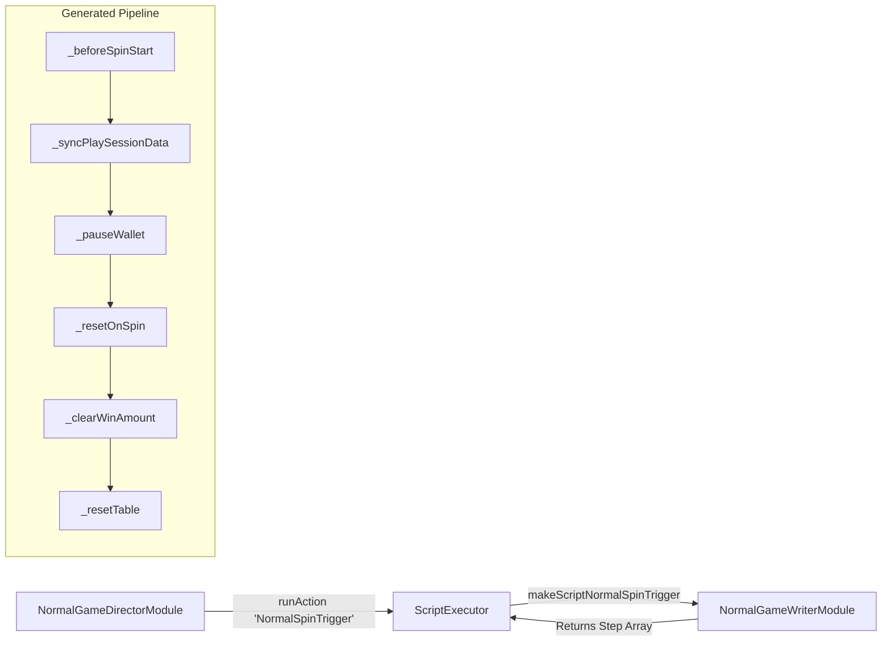

# 🏛️ NormalGameWriterModule Base Game Script Generator Architecture

<!-- convention-summary-start -->
### NormalGameWriterModule Base Game Script Generator Architecture Summary

- **Core Architecture / Purpose**: Technical reference, API contract, and integration guide for NormalGameWriterModule Base Game Script Generator Architecture.
- **Key Mechanisms & Design**: Encapsulates core algorithms, event hooks, and performance optimizations within the slot framework runtime.
- **Domain Capabilities**: cc_slot_module, 01_overview
- **Scope & Code Paths**: `assets/cc-common/cc-slot-module/GameMode/NormalGame/NormalGameWriterModule.ts`
- **Related Docs**: [Master Index](../INDEX.md)
<!-- convention-summary-end -->

## 1. Executive Summary & Purpose

`NormalGameWriterModule` (`assets/cc-common/cc-slot-module/GameMode/NormalGame/NormalGameWriterModule.ts`) is the **Declarative Action Script Generator for Base Game Spins**.

Extending `GameModeWriterModule`, it contains pure synchronous factory methods (`makeScriptNormalSpinTrigger`, `makeScriptPreResumeGameMode`, `makeScriptSyncPlaySessionData`, `makeScriptShowResultFinal`). It builds ordered arrays of command objects that `ScriptExecutor` executes on `NormalGameDirectorModule`.

---

## 2. Core Responsibilities

1. **Spin Preparation Scripting (`makeScriptNormalSpinTrigger`)**: Generates 6-step initialization pipeline (`_beforeSpinStart`, `_syncPlaySessionData`, `_pauseWallet`, `_resetOnSpin`, `_clearWinAmount`, `_resetTable`).
2. **Session Reconnection Scripting (`makeScriptPreResumeGameMode`)**: Assembles `_pauseWallet`, `_resumeNormalTable`, `_setUpPaylines`, `_resumeWinAmount`.
3. **Round Settlement Scripting (`makeScriptShowResultFinal`)**: Assembles `_resumeWallet` to re-enable wallet balance rolling upon round completion.
