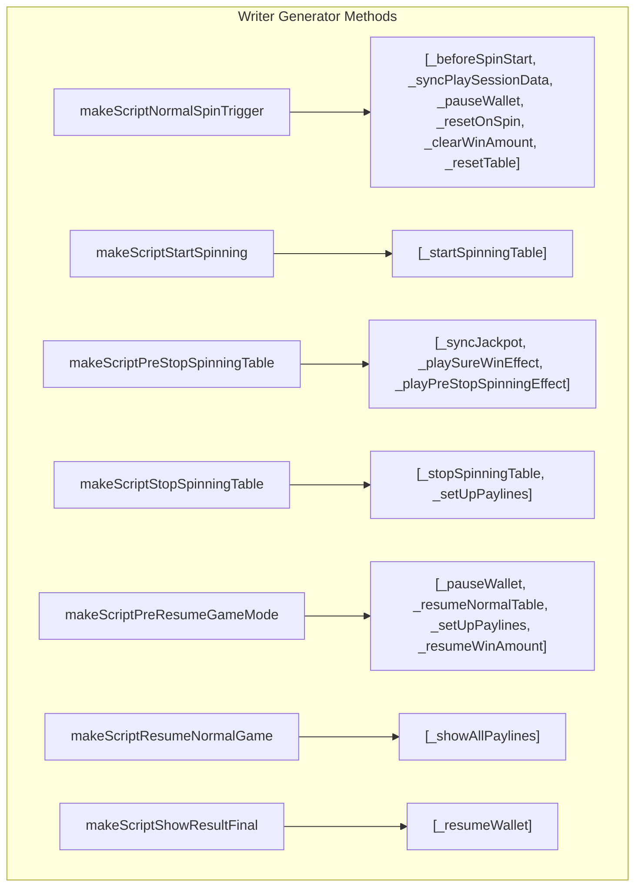

# 🌀 NormalGameWriterModule Declarative Script Flow Breakdown

<!-- convention-summary-start -->
### NormalGameWriterModule Declarative Script Flow Breakdown Summary

- **Core Architecture / Purpose**: Defines network protocol, socket packet lifecycle, state persistence, and error handling for NormalGameWriterModule Declarative Script Flow Breakdown.
- **Key Mechanisms & Design**: Handles WebSocket frame dispatch, acknowledgment confirmation, state resume, and resilient synchronization between client DataStore and Backend Gateway.
- **Domain Capabilities**: cc_slot_module, 02_game_flow
- **Scope & Code Paths**: `assets/cc-common/cc-slot-module/GameMode/NormalGame/NormalGameWriterModule.ts`
- **Related Docs**: [Master Index](../INDEX.md)
<!-- convention-summary-end -->

## 1. The Script Compilation Pipeline

`NormalGameWriterModule` (`assets/cc-common/cc-slot-module/GameMode/NormalGame/NormalGameWriterModule.ts`) is the **synchronous screenplay compiler** for Base Game spins.

When the director requests an action, `NormalGameWriterModule` builds and returns an array of declarative command descriptors:

---

## 2. In-Depth Generator Method Breakdown

| Writer Method | Input Data | Generated Command Array | Purpose & Engine Coordination |
| :--- | :--- | :--- | :--- |
| **`makeScriptNormalSpinTrigger()`** | None | `[_beforeSpinStart, _syncPlaySessionData, _pauseWallet, _resetOnSpin, _clearWinAmount, _resetTable]` | Prepares clean canvas for new spin; freezes wallet; fades out old win numbers. |
| **`makeScriptStartSpinning()`** | None | `[_startSpinningTable]` | Signals table columns to begin spinning. |
| **`makeScriptPreStopSpinningTable()`**| `data` | `[_syncJackpot, _playSureWinEffect, _playPreStopSpinningEffect]` | Runs anticipation teasers and jackpot updates before landing. |
| **`makeScriptStopSpinningTable(data)`**| `data` | `[_stopSpinningTable, _setUpPaylines]` | Decelerates columns with landing matrix and maps win lines. |
| **`makeScriptPreResumeGameMode()`** | `data` | `[_pauseWallet, _resumeNormalTable, _setUpPaylines, _resumeWinAmount]` | Restores matrix and paylines when reconnecting to an active round. |
| **`makeScriptResumeNormalGame()`** | None | `[_showAllPaylines]` | Highlights winning paylines after returning from feature modes. |
| **`makeScriptShowResultFinal()`** | None | `[_resumeWallet]` | Unfreezes wallet to commit payouts to player balance. |
