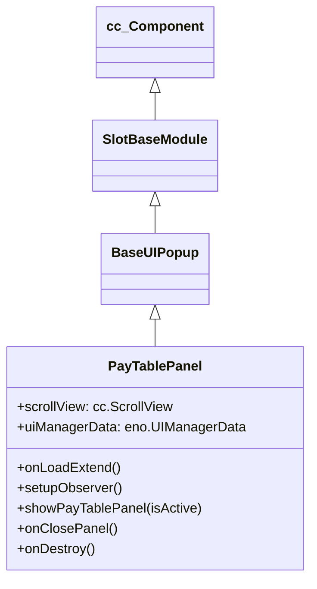

# 🏛️ PayTablePanel Architecture & Role

<!-- convention-summary-start -->
### PayTablePanel Architecture & Role Summary

- **Core Architecture / Purpose**: Technical reference, API contract, and integration guide for PayTablePanel Architecture & Role.
- **Key Mechanisms & Design**: Encapsulates core algorithms, event hooks, and performance optimizations within the slot framework runtime.
- **Domain Capabilities**: cc_slot_module, 01_overview
- **Scope & Code Paths**: `assets/cc-common/cc-slot-module/`
- **Related Docs**: [Master Index](../INDEX.md)
<!-- convention-summary-end -->

`PayTablePanel` is the mobile vertical paytable scroll viewer in the `cc-common` Slot Framework SDK. Inheriting from `BaseUIPopup`, it provides a smooth scrollable rulebook and symbol multiplier calculator tailored for portrait aspect ratios.

---

## 1. Architectural Role

- **Vertical Paytable Viewer**: Manages `scrollView: cc.ScrollView` and resets scroll position to the top on every open.
- **Reactive Model Observer**: Observes `UIManagerData.isPayTablePanelOpen` to toggle popup visibility.
- **Modal Lifecycle**: Emits `CLOSE_PAY_TABLE_PANEL` when dismissed.

---

## 2. Inheritance Diagram

