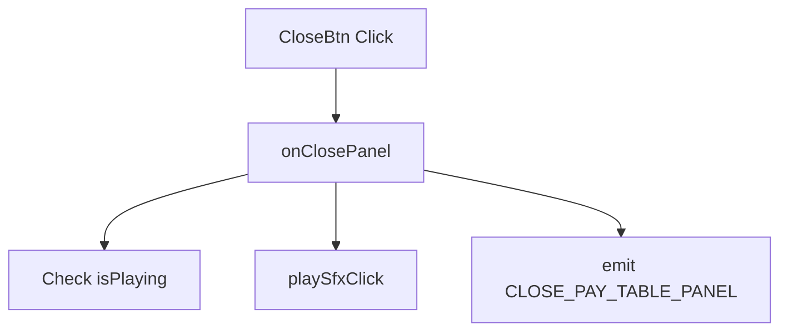

# 📖 `PayTablePanel.onClosePanel()`

<!-- convention-summary-start -->
### PayTablePanel.onClosePanel Method Summary

- **Core Architecture / Purpose**: Technical reference, API contract, and integration guide for PayTablePanel.onClosePanel Method.
- **Key Mechanisms & Design**: Encapsulates core algorithms, event hooks, and performance optimizations within the slot framework runtime.
- **Domain Capabilities**: cc_slot_module, 05_methods
- **Scope & Code Paths**: `assets/cc-common/cc-slot-module/`
- **Related Docs**: [Master Index](../INDEX.md)
<!-- convention-summary-end -->


---

## 1. Method Overview & Signature

Handles the close button click, validating animation states and dispatching dismissal events.

```typescript
public onClosePanel(): void
```

---

## 2. Trigger Source & Execution Lifecycle

- **Trigger**: Player taps the close button on the paytable header.

---

## 3. Detailed Algorithmic Breakdown

1. Checks `if (this.popupBehavior && this.popupBehavior.isPlaying()) return;` to prevent animation collisions.
2. Plays click SFX via `this.playSfxClick()`.
3. Emits `GameLogicUIEvents.CLOSE_PAY_TABLE_PANEL` to `gameLogic`.

---

## 4. Caller & Callee Execution Graph



---

## 5. Parameters & Return Value Specification

| Parameter | Type | Description |
| :--- | :--- | :--- |
| None | `void` | Button click handler. |

---

## 6. Complete Source Code Implementation

```typescript
onClosePanel(): void {
	if (this.popupBehavior && this.popupBehavior.isPlaying()) {
		return;
	}
	this.playSfxClick();
	this.gameLogic.emit(GameLogicUIEvents.CLOSE_PAY_TABLE_PANEL);
}
```
