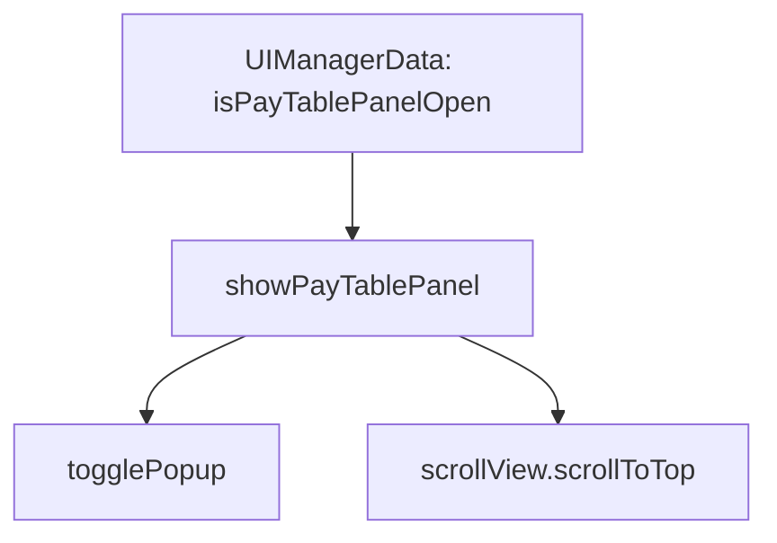

# 📖 `PayTablePanel.showPayTablePanel()`

<!-- convention-summary-start -->
### PayTablePanel.showPayTablePanel Method Summary

- **Core Architecture / Purpose**: Technical reference, API contract, and integration guide for PayTablePanel.showPayTablePanel Method.
- **Key Mechanisms & Design**: Encapsulates core algorithms, event hooks, and performance optimizations within the slot framework runtime.
- **Domain Capabilities**: cc_slot_module, 05_methods
- **Scope & Code Paths**: `assets/cc-common/cc-slot-module/`
- **Related Docs**: [Master Index](../INDEX.md)
<!-- convention-summary-end -->


---

## 1. Method Overview & Signature

Toggles popup modal visibility and resets the scroll position to the top header when opened.

```typescript
public showPayTablePanel(isActive: boolean): void
```

---

## 2. Trigger Source & Execution Lifecycle

- **Invoker**: Reactively triggered when `UIManagerData.isPayTablePanelOpen` changes.

---

## 3. Detailed Algorithmic Breakdown

1. Calls `this.togglePopup(isActive)` to run fade/slide popup behavior.
2. If `isActive` is `true`, executes `this.scrollView.scrollToTop(0)` to reset scroll offset.

---

## 4. Caller & Callee Execution Graph



---

## 5. Parameters & Return Value Specification

| Parameter | Type | Description |
| :--- | :--- | :--- |
| `isActive` | `boolean` | `true` to display paytable; `false` to dismiss. |

---

## 6. Complete Source Code Implementation

```typescript
showPayTablePanel(isActive: boolean): void {
	this.togglePopup(isActive);
	if (isActive) {
		if (this.scrollView) {
			this.scrollView.scrollToTop(0);
		}
	}
}
```
