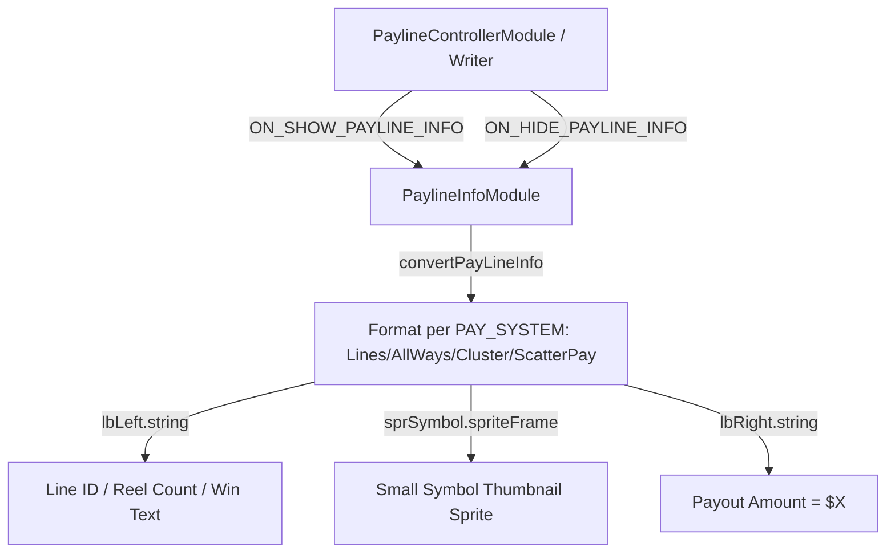

# 🏛️ PaylineInfoModule Architectural Role & Payline Toast HUD

<!-- convention-summary-start -->
### PaylineInfoModule Architectural Role & Payline Toast HUD Summary

- **Core Architecture / Purpose**: Technical reference, API contract, and integration guide for PaylineInfoModule Architectural Role & Payline Toast HUD.
- **Key Mechanisms & Design**: Encapsulates core algorithms, event hooks, and performance optimizations within the slot framework runtime.
- **Domain Capabilities**: cc_slot_module, 01_overview
- **Scope & Code Paths**: `assets/cc-common/cc-slot-module/`
- **Related Docs**: [Master Index](../INDEX.md)
<!-- convention-summary-end -->

---

## 1. Architectural Mission

`PaylineInfoModule` manages the floating notification banner anchored above or below the slot reels mounted at `Canvas/Director/UIManager/PaylineInfo`. As winning lines/ways cycle during payline presentation, it dynamically formats payline metadata based on the active math system (`LINES`, `ALLWAYS`, `CLUSTER`, `SCATTER_PAY`), rendering symbol thumbnails, line indices, multiplier quantities, and total payouts.

---

## 2. Key Responsibilities

1. **Multi-Math Formatting (`convertPayLineInfo`)**:
   - Seamlessly converts payline data payloads for 4 slot systems: `LINES`, `ALLWAYS`, `CLUSTER`, and `SCATTER_PAY`.
2. **Dynamic Symbol Thumbnails (`_symbolAssets`)**:
   - Lookups small symbol sprite frames by prefix and ID (`${smallSymbolPrefix}${symbolId}`).
3. **Game Mode Filtering (`shouldWorkInCurrentGameMode`)**:
   - Gated to specific game modes or globally enabled (`useAcrossAllGameModes`).
