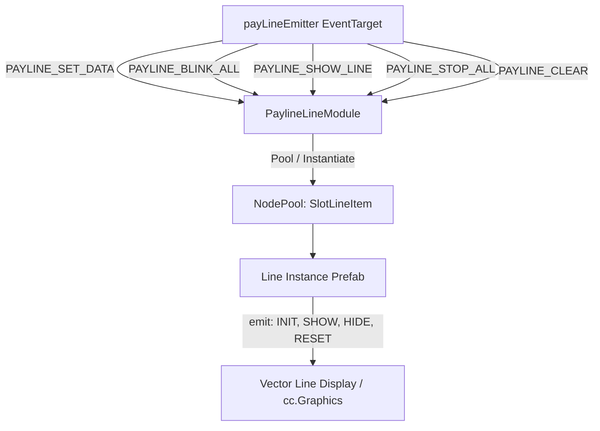

# 🏛️ PaylineLineModule Architectural Role & Core Responsibilities

<!-- convention-summary-start -->
### PaylineLineModule Architectural Role & Core Responsibilities Summary

- **Core Architecture / Purpose**: Technical reference, API contract, and integration guide for PaylineLineModule Architectural Role & Core Responsibilities.
- **Key Mechanisms & Design**: Encapsulates core algorithms, event hooks, and performance optimizations within the slot framework runtime.
- **Domain Capabilities**: cc_slot_module, 01_overview
- **Scope & Code Paths**: `assets/cc-common/cc-slot-module/`
- **Related Docs**: [Master Index](../INDEX.md)
<!-- convention-summary-end -->

---

## 1. Architectural Mission

`PaylineLineModule` is the visual line rendering component of the Payline subsystem in `cc-slot-module`. Its primary responsibility is to render connecting vector paths or display line segment prefabs across the reel matrix corresponding to winning line IDs (`payLineID`).

---

## 2. Key Responsibilities

1. **Node Pooling (`SlotLineItem`)**:
   - Manages a zero-allocation `cc.NodePool("SlotLineItem")` for line prefabs (`template`).
2. **Dual Operation Modes**:
   - `usePrefab = true`: Dynamically instantiates and pools line visual items.
   - `usePrefab = false`: Uses pre-placed node arrays (`lines[lineID]`).
3. **Stage 1 Concurrent Blink**:
   - On `PAYLINE_BLINK_ALL`, iterates through all winning `payLines` and displays each connecting line simultaneously.
4. **Stage 2 Isolated Cycling**:
   - On `PAYLINE_SHOW_LINE`, hides other lines (`hideAll()`) and displays only the active `payLineID`.
5. **Event Emission to Line Nodes**:
   - Drives child line nodes using localized lifecycle events: `"INIT"`, `"SHOW"`, `"HIDE"`, `"RESET"`.
