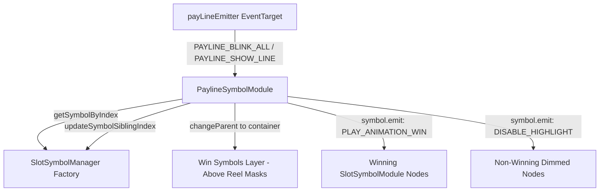

# 🏛️ PaylineSymbolModule Architecture & Role

<!-- convention-summary-start -->
### PaylineSymbolModule Architecture & Role Summary

- **Core Architecture / Purpose**: Technical reference, API contract, and integration guide for PaylineSymbolModule Architecture & Role.
- **Key Mechanisms & Design**: Encapsulates core algorithms, event hooks, and performance optimizations within the slot framework runtime.
- **Domain Capabilities**: cc_slot_module, 01_overview
- **Scope & Code Paths**: `assets/cc-common/cc-slot-module/BaseModule/Payline/PaylineModule/scripts/PaylineSymbolModule.ts`
- **Related Docs**: [Master Index](../INDEX.md)
<!-- convention-summary-end -->

---

## 1. Architectural Purpose

`PaylineSymbolModule` (`assets/cc-common/cc-slot-module/BaseModule/Payline/PaylineModule/scripts/PaylineSymbolModule.ts`) is the **Symbol Win Presentation Engine** in the `cc-common` Payline subsystem.

It dynamically reparents winning `SlotSymbolModule` instances into a top-level `container` layer above the reel mask, triggers Spine skeleton win animations (`PLAY_ANIMATION_WIN`), dims non-winning symbols (`SHOW_STATIC`, `DISABLE_HIGHLIGHT`), and re-sorts z-indices via `SlotSymbolManager.updateSymbolSiblingIndex()`.

---

## 2. Core Responsibilities

1. **Symbol Mapping (`mapSymbolToPayLine`)**: Bridges matrix coordinates `[reel][row]` to active pooled symbol instances from `SlotSymbolManager`.
2. **Win Animation Orchestration (`showListWinSymbols`)**: Dimms unhit symbols and activates win loops/spines for participating hit symbols.
3. **Z-Ordering & Parent Transfer**: Reparents symbols into `this.container` or `disableHighlightContainer` ensuring win animations are never clipped by column mask rects.
4. **Lifecycle Recycling (`clearAll`)**: Returns reparented symbols safely to `SlotSymbolManager` and resets highlight flags.
