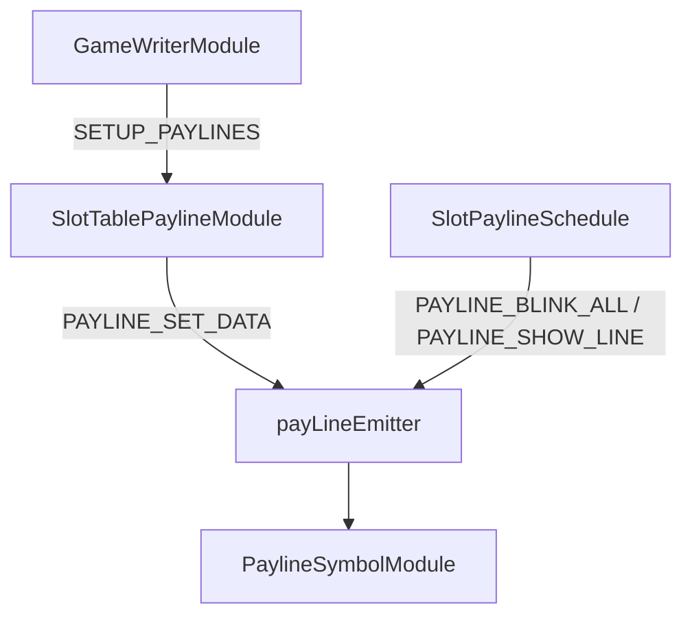

# 🎼 PaylineSymbolModule Pipeline Orchestration

<!-- convention-summary-start -->
### PaylineSymbolModule Pipeline Orchestration Summary

- **Core Architecture / Purpose**: Technical reference, API contract, and integration guide for PaylineSymbolModule Pipeline Orchestration.
- **Key Mechanisms & Design**: Encapsulates core algorithms, event hooks, and performance optimizations within the slot framework runtime.
- **Domain Capabilities**: cc_slot_module, 03_director_writer_integration
- **Scope & Code Paths**: `assets/cc-common/cc-slot-module/`
- **Related Docs**: [Master Index](../INDEX.md)
<!-- convention-summary-end -->

---

## 1. Interaction Pipeline

Controlled indirectly via `SlotTablePaylineModule` and `SlotPaylineSchedule`:

