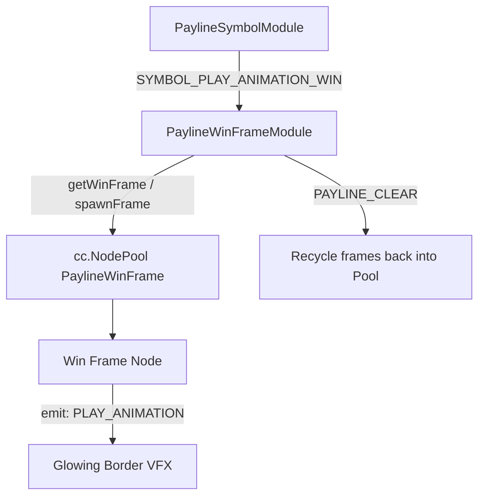

# 🏛️ PaylineWinFrameModule Architecture & Role

<!-- convention-summary-start -->
### PaylineWinFrameModule Architecture & Role Summary

- **Core Architecture / Purpose**: Technical reference, API contract, and integration guide for PaylineWinFrameModule Architecture & Role.
- **Key Mechanisms & Design**: Encapsulates core algorithms, event hooks, and performance optimizations within the slot framework runtime.
- **Domain Capabilities**: cc_slot_module, 01_overview
- **Scope & Code Paths**: `assets/cc-common/cc-slot-module/BaseModule/Payline/PaylineModule/WinFrame/scripts/PaylineWinFrameModule.ts`
- **Related Docs**: [Master Index](../INDEX.md)
<!-- convention-summary-end -->

---

## 1. Architectural Purpose

`PaylineWinFrameModule` (`assets/cc-common/cc-slot-module/BaseModule/Payline/PaylineModule/WinFrame/scripts/PaylineWinFrameModule.ts`) is the **Decorative Win Frame Box Overlay Engine** in the `cc-common` Slot SDK.

When winning symbols animate, `PaylineWinFrameModule`:
1. Listens to `SYMBOL_PLAY_ANIMATION_WIN` from `PaylineSymbolModule`.
2. Spawns or retrieves cached border frames from a local `cc.NodePool("PaylineWinFrame")`.
3. Positions the frame at the symbol's grid coordinates `(reel, row)`.
4. Triggers `winFrame.emit('PLAY_ANIMATION', '', duration)` to render glowing golden/neon borders around winning combinations.

---

## 2. Core Responsibilities

1. **Zero-Allocation Node Pooling**: Maintains `winFramePool` to eliminate Garbage Collection hit spikes during rapid spin sequences.
2. **Synchronized Playback**: Automatically matches the duration and active state of the underlying winning symbol animation.
3. **Clean Teardown**: Recycles frames via `this.winFramePool.put(frame)` upon `PAYLINE_CLEAR`.
