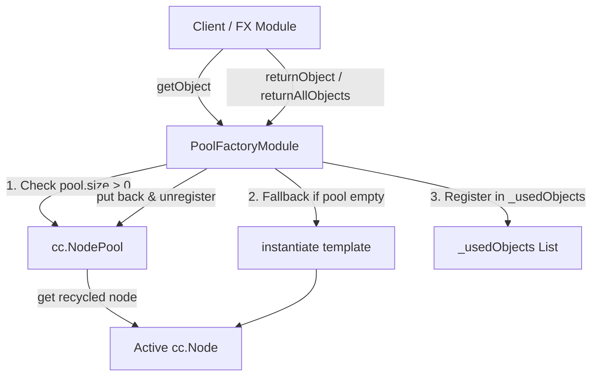

# 🏛️ PoolFactoryModule Architectural Role & Node Pooling Factory

<!-- convention-summary-start -->
### PoolFactoryModule Architectural Role & Node Pooling Factory Summary

- **Core Architecture / Purpose**: Technical reference, API contract, and integration guide for PoolFactoryModule Architectural Role & Node Pooling Factory.
- **Key Mechanisms & Design**: Encapsulates core algorithms, event hooks, and performance optimizations within the slot framework runtime.
- **Domain Capabilities**: cc_slot_module, 01_overview
- **Scope & Code Paths**: `assets/cc-common/cc-slot-module/`
- **Related Docs**: [Master Index](../INDEX.md)
<!-- convention-summary-end -->

---

## 1. Architectural Mission

`PoolFactoryModule` is the **standard generic object pooling factory** in the Cocos Common (`cc-common`) Slot Framework SDK. It encapsulates Cocos Creator's native `cc.NodePool`, providing pre-instantiation, checked-out instance tracking (`_usedObjects`), dynamic instantiation fallbacks, and safe bulk recycling (`returnAllObjects`, `clear`).

---

## 2. Key Responsibilities

1. **Pre-Allocation & Warmup**:
   - In `onLoad()`, pre-instantiates `initCount` instances of `template: cc.Prefab` and seeds them into the internal `cc.NodePool`.
2. **Lifecycle Tracking**:
   - Maintains an array of currently active objects in `_usedObjects` to prevent node leaks and ensure clean state resets between spins or mode switches.
3. **Graceful Fallback & Destruction**:
   - If the pool is empty when `getObject()` is called, dynamically calls `cc.instantiate(this.template)`.
   - If `returnObject()` is invoked after the pool is cleared/destroyed, safely falls back to `obj.destroy()`.
