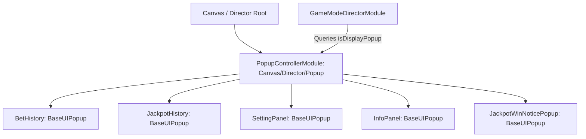

# 🏛️ PopupControllerModule Architectural Role & Master Popup Container

<!-- convention-summary-start -->
### PopupControllerModule Architectural Role & Master Popup Container Summary

- **Core Architecture / Purpose**: Technical reference, API contract, and integration guide for PopupControllerModule Architectural Role & Master Popup Container.
- **Key Mechanisms & Design**: Encapsulates core algorithms, event hooks, and performance optimizations within the slot framework runtime.
- **Domain Capabilities**: cc_slot_module, 01_overview
- **Scope & Code Paths**: `assets/cc-common/cc-slot-module/`
- **Related Docs**: [Master Index](../INDEX.md)
<!-- convention-summary-end -->

---

## 1. Architectural Mission

`PopupControllerModule` acts as the master container component mounted at `Canvas/Director/Popup`. It controls the initialization of all child modal dialogs (`BetHistory`, `JackpotHistory`, `SettingPanel`, `InfoPanel`, `JackpotWinNoticePopup`), ensuring child popup lifecycle methods (`onLoad`) execute on startup, and provides `isDisplayPopup()` querying for input gating across the slot machine.

---

## 2. Key Responsibilities

1. **Child Lifecycle Activation (`onLoad`)**:
   - Temporarily activates all child modal dialog nodes so their respective `onLoad()` / `onLoadExtend()` bindings register before hiding.
2. **Global Popup Query (`isDisplayPopup`)**:
   - Returns boolean `true` if any child popup is active, allowing spin buttons and keyboard shortcuts (Spacebar) to lock out spin requests while modals are open.
