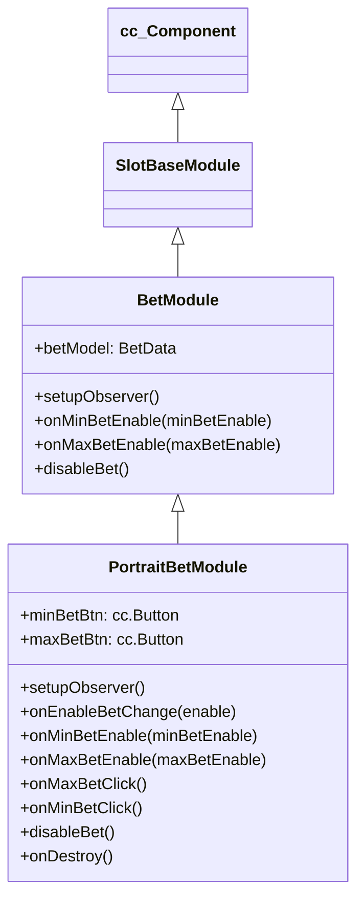

# 🏛️ PortraitBetModule Architecture & Role

<!-- convention-summary-start -->
### PortraitBetModule Architecture & Role Summary

- **Core Architecture / Purpose**: Technical reference, API contract, and integration guide for PortraitBetModule Architecture & Role.
- **Key Mechanisms & Design**: Encapsulates core algorithms, event hooks, and performance optimizations within the slot framework runtime.
- **Domain Capabilities**: cc_slot_module, 01_overview
- **Scope & Code Paths**: `assets/cc-common/cc-slot-module/`
- **Related Docs**: [Master Index](../INDEX.md)
<!-- convention-summary-end -->

`PortraitBetModule` is the mobile-tailored betting HUD component in the `cc-common` Slot Framework SDK. Inheriting from `BetModule`, it enhances the standard bet adjustment interface with dedicated Minimum Bet (`minBetBtn`) and Maximum Bet (`maxBetBtn`) shortcut buttons, dynamic interactive states, and toast alert dispatches.

---

## 1. Architectural Role & Inheritance

- **Subclass of `BetModule`**: Inherits currency formatting, denomination steppers, and reactive observation of `BetData`.
- **Portrait Layout Optimization**: Manages quick-action boundary buttons (`minBetBtn`, `maxBetBtn`) designed for one-handed mobile ergonomics.
- **Toast Notifications**: Dispatches `HIT_MAX_BET` and `HIT_MIN_BET` events to `GameUIEvents.UI_TOAST` when boundaries are tapped.

---

## 2. Inheritance Diagram

