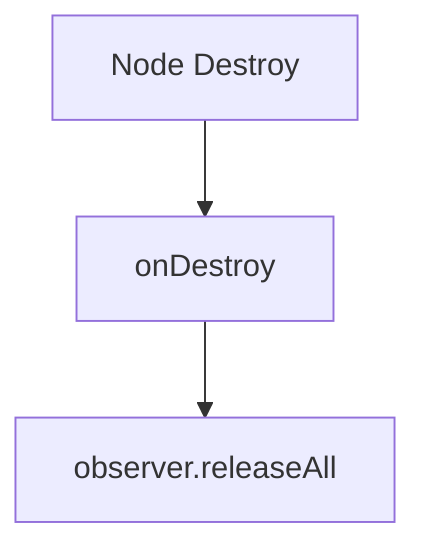

# 📖 `PortraitBetModule.onDestroy()`

<!-- convention-summary-start -->
### PortraitBetModule.onDestroy Method Summary

- **Core Architecture / Purpose**: Technical reference, API contract, and integration guide for PortraitBetModule.onDestroy Method.
- **Key Mechanisms & Design**: Encapsulates core algorithms, event hooks, and performance optimizations within the slot framework runtime.
- **Domain Capabilities**: cc_slot_module, 05_methods
- **Scope & Code Paths**: `assets/cc-common/cc-slot-module/`
- **Related Docs**: [Master Index](../INDEX.md)
<!-- convention-summary-end -->


---

## 1. Method Overview & Signature

Cleans up BetData observer subscriptions on destruction.

```typescript
public onDestroy(): void
```

---

## 2. Trigger Source & Execution Lifecycle

- **Invoker**: Cocos Creator node destruction lifecycle.

---

## 3. Detailed Algorithmic Breakdown

1. Invokes `this.observer.releaseAll(this.betModel, this)` to unbind all watchers.

---

## 4. Caller & Callee Execution Graph



---

## 5. Parameters & Return Value Specification

| Parameter | Type | Description |
| :--- | :--- | :--- |
| None | `void` | Teardown hook. |

---

## 6. Complete Source Code Implementation

```typescript
onDestroy(): void {
	this.observer.releaseAll(this.betModel, this);
}
```
