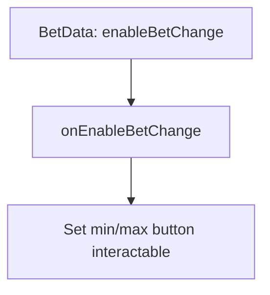

# 📖 `PortraitBetModule.onEnableBetChange()`

<!-- convention-summary-start -->
### PortraitBetModule.onEnableBetChange Method Summary

- **Core Architecture / Purpose**: Technical reference, API contract, and integration guide for PortraitBetModule.onEnableBetChange Method.
- **Key Mechanisms & Design**: Encapsulates core algorithms, event hooks, and performance optimizations within the slot framework runtime.
- **Domain Capabilities**: cc_slot_module, 05_methods
- **Scope & Code Paths**: `assets/cc-common/cc-slot-module/`
- **Related Docs**: [Master Index](../INDEX.md)
<!-- convention-summary-end -->


---

## 1. Method Overview & Signature

Toggles the interactive state of the minimum and maximum bet shortcut buttons.

```typescript
public onEnableBetChange(enable: boolean): void
```

---

## 2. Trigger Source & Execution Lifecycle

- **Invoker**: Triggered reactively by `BetData.enableBetChange`.
- **Context**: Disables during spin rolling; enables when returning to idle.

---

## 3. Detailed Algorithmic Breakdown

1. Sets `this.maxBetBtn.interactable = enable`.
2. Sets `this.minBetBtn.interactable = enable`.

---

## 4. Caller & Callee Execution Graph



---

## 5. Parameters & Return Value Specification

| Parameter | Type | Description |
| :--- | :--- | :--- |
| `enable` | `boolean` | `true` if bet can be altered; `false` during active spin. |

---

## 6. Complete Source Code Implementation

```typescript
onEnableBetChange(enable: boolean): void {
	this.maxBetBtn.interactable = enable;
	this.minBetBtn.interactable = enable;
}
```
