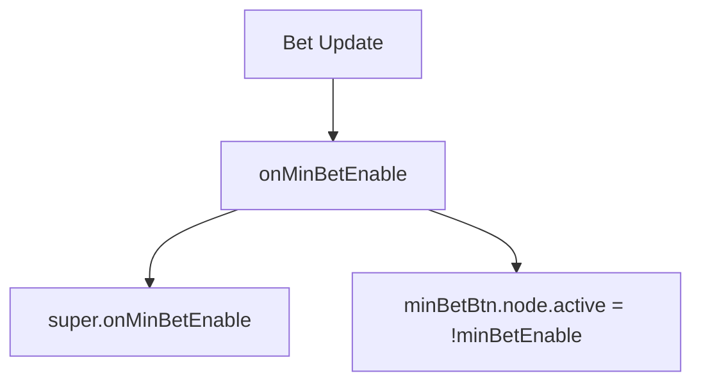

# 📖 `PortraitBetModule.onMinBetEnable()`

<!-- convention-summary-start -->
### PortraitBetModule.onMinBetEnable Method Summary

- **Core Architecture / Purpose**: Technical reference, API contract, and integration guide for PortraitBetModule.onMinBetEnable Method.
- **Key Mechanisms & Design**: Encapsulates core algorithms, event hooks, and performance optimizations within the slot framework runtime.
- **Domain Capabilities**: cc_slot_module, 05_methods
- **Scope & Code Paths**: `assets/cc-common/cc-slot-module/`
- **Related Docs**: [Master Index](../INDEX.md)
<!-- convention-summary-end -->


---

## 1. Method Overview & Signature

Updates the visibility of the Min Bet button based on whether the bet can still be decreased.

```typescript
public onMinBetEnable(minBetEnable: boolean): void
```

---

## 2. Trigger Source & Execution Lifecycle

- **Invoker**: Called when active bet level changes.

---

## 3. Detailed Algorithmic Breakdown

1. Calls `super.onMinBetEnable(minBetEnable)`.
2. Sets `this.minBetBtn.node.active = !minBetEnable` (inverted logic so button disappears when minimum boundary is reached).

---

## 4. Caller & Callee Execution Graph



---

## 5. Parameters & Return Value Specification

| Parameter | Type | Description |
| :--- | :--- | :--- |
| `minBetEnable` | `boolean` | `true` if already at min bet limit. |

---

## 6. Complete Source Code Implementation

```typescript
onMinBetEnable(minBetEnable: boolean): void {
	super.onMinBetEnable(minBetEnable);
	this.minBetBtn.node.active = !minBetEnable;
}
```
