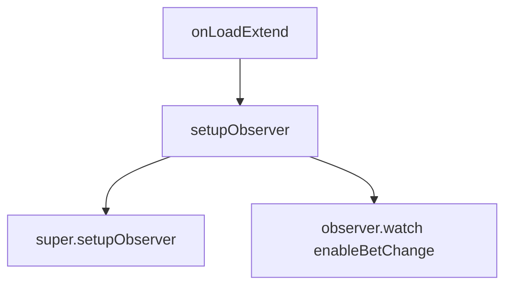

# 📖 `PortraitBetModule.setupObserver()`

<!-- convention-summary-start -->
### PortraitBetModule.setupObserver Method Summary

- **Core Architecture / Purpose**: Technical reference, API contract, and integration guide for PortraitBetModule.setupObserver Method.
- **Key Mechanisms & Design**: Encapsulates core algorithms, event hooks, and performance optimizations within the slot framework runtime.
- **Domain Capabilities**: cc_slot_module, 05_methods
- **Scope & Code Paths**: `assets/cc-common/cc-slot-module/`
- **Related Docs**: [Master Index](../INDEX.md)
<!-- convention-summary-end -->


---

## 1. Method Overview & Signature

Establishes reactive observers on `BetData.enableBetChange` and hides shortcut buttons on startup.

```typescript
public setupObserver(): void
```

---

## 2. Trigger Source & Execution Lifecycle

- **Invoker**: Called by `SlotBaseModule.onLoad()`.
- **Lifecycle**: Bootstrap.

---

## 3. Detailed Algorithmic Breakdown

1. Calls `super.setupObserver()` to initialize parent `BetModule` watchers.
2. Subscribes `this.onEnableBetChange` to `this.betModel.enableBetChange`.
3. Sets `this.minBetBtn.node.active = false` and `this.maxBetBtn.node.active = false` until bet models resolve.

---

## 4. Caller & Callee Execution Graph



---

## 5. Parameters & Return Value Specification

| Parameter | Type | Description |
| :--- | :--- | :--- |
| None | `void` | Lifecycle method. |

| Return | Type | Description |
| :--- | :--- | :--- |
| `void` | `void` | None. |

---

## 6. Complete Source Code Implementation

```typescript
setupObserver(): void {
	super.setupObserver();
	this.observer.watch(this.betModel, "enableBetChange", this.onEnableBetChange.bind(this), this);
	this.minBetBtn.node.active = false;
	this.maxBetBtn.node.active = false;
}
```
