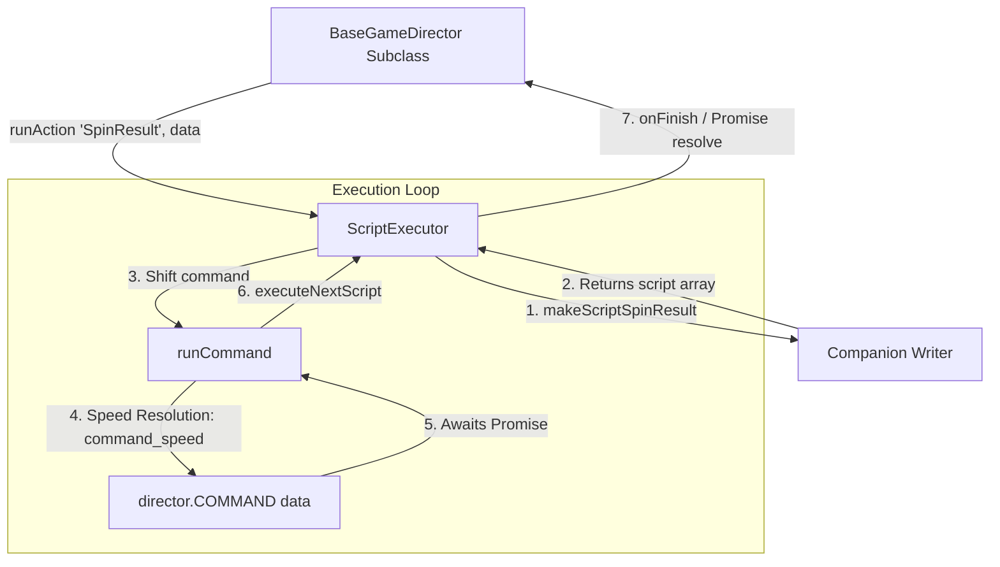

# 🏛️ ScriptExecutor Asynchronous Action Step Engine Architecture

<!-- convention-summary-start -->
### ScriptExecutor Asynchronous Action Step Engine Architecture Summary

- **Core Architecture / Purpose**: Technical reference, API contract, and integration guide for ScriptExecutor Asynchronous Action Step Engine Architecture.
- **Key Mechanisms & Design**: Encapsulates core algorithms, event hooks, and performance optimizations within the slot framework runtime.
- **Domain Capabilities**: cc_slot_module, 01_overview
- **Scope & Code Paths**: `assets/cc-common/cc-slot-module/GameMode/Core/ScriptExecutor.ts`
- **Related Docs**: [Master Index](../INDEX.md)
<!-- convention-summary-end -->

## 1. Executive Summary & Purpose

`ScriptExecutor` (`assets/cc-common/cc-slot-module/GameMode/Core/ScriptExecutor.ts`) is the **Asynchronous Command Queue Processor** in the `cc-common` Slot SDK.

Constructed by `BaseGameDirector.init()`, `ScriptExecutor` bridges the declarative script arrays produced by Writers (`writer.makeScript[ActionName]`) with the concrete asynchronous execution methods on Directors (`director[command](data)`).

---

## 2. Core Responsibilities

1. **Sequential Action Pipeline Execution**: Executes command arrays step by step, ensuring subsequent animations do not begin until the prior step's Promise resolves.
2. **Speed-Specialized Command Routing**: Automatically routes commands to speed-suffixed variants (e.g. `STOP_REEL_2` or `STOP_REEL_1`) if declared on the director.
3. **Graceful Action Interruption & Reset**: Transforms in-flight commands to `_reset[Command]` when quick-stopping or returning to real mode.
4. **Stylized Debug Logging**: Integrates with `eno.Logger` with color-coded tags (`[Action]`, `[Running]`, `[Skipping]`, `[Finish]`).
