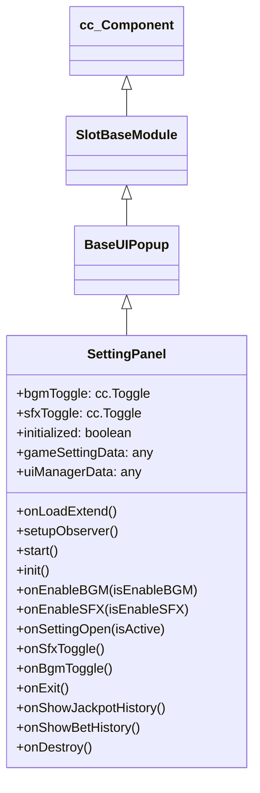

# 🏛️ SettingPanel Architecture & Role

<!-- convention-summary-start -->
### SettingPanel Architecture & Role Summary

- **Core Architecture / Purpose**: Technical reference, API contract, and integration guide for SettingPanel Architecture & Role.
- **Key Mechanisms & Design**: Encapsulates core algorithms, event hooks, and performance optimizations within the slot framework runtime.
- **Domain Capabilities**: cc_slot_module, 01_overview
- **Scope & Code Paths**: `assets/cc-common/cc-slot-module/`
- **Related Docs**: [Master Index](../INDEX.md)
<!-- convention-summary-end -->


`SettingPanel` is the settings modal controller in the `cc-common` Slot Framework SDK. Inheriting from `BaseUIPopup`, it manages player audio preferences (BGM and SFX toggle switches) and provides entry points to secondary sub-panels (Bet History and Jackpot History).

---

## 1. Architectural Boundaries & System Role

- **Audio Preference Synchronization**: Observes `GameSettingData.isEnableBGM` and `isEnableSFX`, synchronizing `cc.Toggle` checkbox visual states and updating `SlotSoundPlayerModule` volume muting.
- **Popup Sub-Panel Router**: Emits navigation events to open `BetHistoryModule` (`OPEN_BET_HISTORY_PANEL`) and `JackpotHistoryModule` (`OPEN_JACKPOT_HISTORY_PANEL`).
- **Initialization Workaround**: Utilizes an internal `initialized` guard boolean to suppress unwanted click SFX during initial toggle checkmark setup.

---

## 2. Component Hierarchy

Canonical Node Path: `Canvas/Director/Popup/Setting`

```text
Canvas/Director/Popup/Setting (SettingPanel, FadePopupBehavior)
├── Background (cc.Sprite)
├── Header
│   ├── Title (cc.Label / cc.Sprite)
│   └── CloseButton (cc.Button)
├── Content
│   ├── BGM_Toggle (cc.Toggle)
│   ├── SFX_Toggle (cc.Toggle)
│   ├── BetHistoryBtn (cc.Button)
│   └── JackpotHistoryBtn (cc.Button)
└── VersionLabel (cc.Label)
```

---

## 3. Inheritance Diagram


