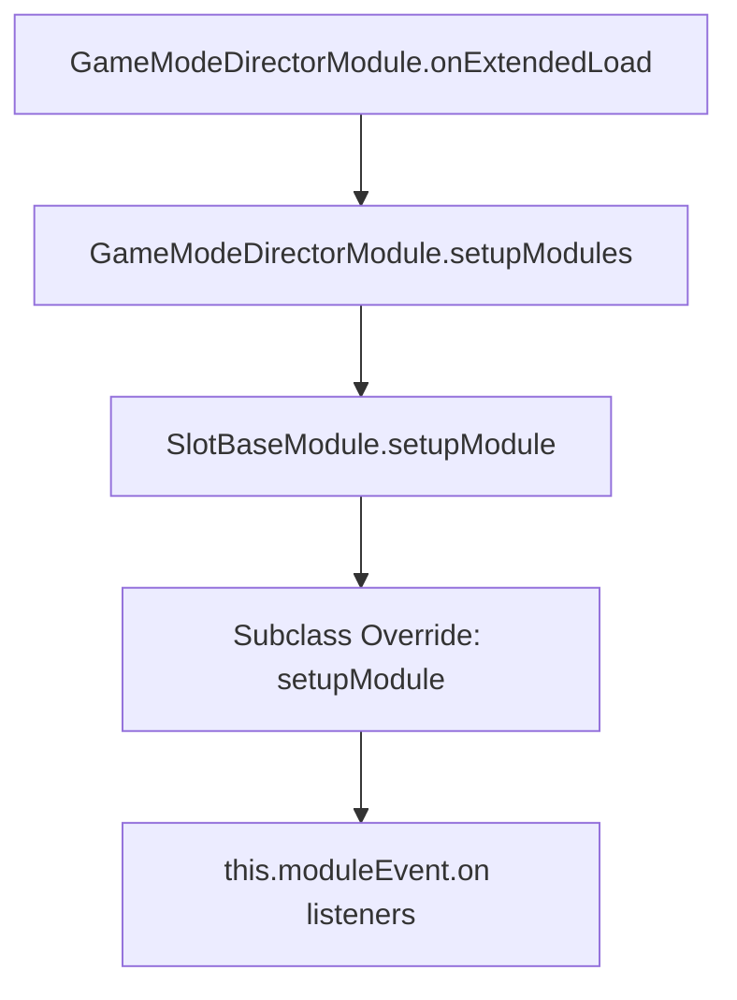

# 📖 `SlotBaseModule.setupModule()` Deep Specification

<!-- convention-summary-start -->
### SlotBaseModule.setupModule Method Deep Specification Summary

- **Core Architecture / Purpose**: Technical reference, API contract, and integration guide for SlotBaseModule.setupModule Method Deep Specification.
- **Key Mechanisms & Design**: Encapsulates core algorithms, event hooks, and performance optimizations within the slot framework runtime.
- **Domain Capabilities**: cc_slot_module, 05_methods
- **Scope & Code Paths**: `assets/cc-common/cc-slot-module/`
- **Related Docs**: [Master Index](../INDEX.md)
<!-- convention-summary-end -->


---

## 1. Method Overview & Signature

`setupModule` establishes the architectural binding between a child slot component and its parent **Game Mode hierarchy** (`NormalGame`, `FreeGame`, `BonusGame`).

It executes the following tasks:
1. Injects the Mode-Scoped Event Bus (`moduleEvent`).
2. Assigns the active game mode identifier (`gameMode`).
3. Enforces an architectural integrity guard to prevent cross-mode component contamination.

```typescript
public setupModule(moduleEvent: GameModuleEvent, gameMode: any): void
```

---

## 2. When Is It Called & Trigger Source

* **Trigger Moment**: Invoked during the initialization phase of a Game Mode Director (`GameModeDirectorModule.onExtendedLoad()`).
* **Caller**: `GameModeDirectorModule.setupModules()` iterating over its configured `moduleList`.
* **Execution Frequency**: Exactly once per component lifecycle when the Game Mode mounts.

---

## 3. Detailed Algorithmic Logic

1. **Duplicate Registration Check**: Evaluates if `this.moduleEvent !== null`. If already assigned, throws a runtime console error (`[ModuleRegistry] Module <name> is registered to multiple GameMode...`).
2. **Field Assignment**: Assigns the passed `moduleEvent` instance to `this.moduleEvent`.
3. **Mode Assignment**: Assigns `gameMode` to `this.gameMode`.

---

## 4. Caller & Callee Graph



---

## 5. Complete Source Code Implementation

```typescript
setupModule(moduleEvent: GameModuleEvent, gameMode): void {
    if (this.moduleEvent !== null) {
        error(`[ModuleRegistry] Module ${this.node.name} is registered to multiple GameMode. Please clone module or use GameEventManager to control event.`);
    }
    this.moduleEvent = moduleEvent;
    this.gameMode = gameMode;
}
```

---

## 6. Subclass Override Pattern

```typescript
import { SlotBaseModule } from "cc-slot-module/Core/SlotBaseModule";
import { GameModuleEvent } from "cc-slot-module/GameMode/GameModuleEvent";

const { ccclass } = cc._decorator;

@ccclass
export class CustomSlotTableModule extends SlotBaseModule {

    setupModule(moduleEvent: GameModuleEvent, gameMode: any): void {
        // 1. Mandatory super call to preserve guards and property assignments
        super.setupModule(moduleEvent, gameMode);

        // 2. Register mode-scoped listeners
        this.moduleEvent.on("TABLE_INIT", this.onTableInit, this);
        this.moduleEvent.on("TABLE_START_SPIN", this.onTableStartSpin, this);
        this.moduleEvent.on("TABLE_STOP_SPIN", this.onTableStopSpin, this);
        this.moduleEvent.on("TABLE_FAST_STOP", this.onTableFastStop, this);
    }

    private onTableInit(): void {
        // Initialize grid
    }

    private onTableStartSpin(): void {
        // Accelerate reels
    }

    private onTableStopSpin(data: any): void {
        // Stop reels with matrix payload
    }

    private onTableFastStop(): void {
        // Instant brake
    }
}
```
