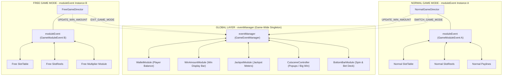

# ⚖️ `eventManager` vs `moduleEvent` Architectural Comparison

<!-- convention-summary-start -->
### SlotBaseModule: eventManager vs moduleEvent Architectural Comparison Summary

- **Core Architecture / Purpose**: Technical reference, API contract, and integration guide for SlotBaseModule: eventManager vs moduleEvent Architectural Comparison.
- **Key Mechanisms & Design**: Encapsulates core algorithms, event hooks, and performance optimizations within the slot framework runtime.
- **Domain Capabilities**: cc_slot_module, 06_events
- **Scope & Code Paths**: `assets/cc-common/cc-slot-module/`
- **Related Docs**: [Master Index](../INDEX.md)
<!-- convention-summary-end -->


---

## 1. Architectural Comparison Matrix

Both `eventManager` and `moduleEvent` share the underlying `GameEventManager` engine implementation (providing `on`, `off`, `emit` with `Promise.all` concurrency, and `targetOff`). However, their **Scope**, **Lifecycle**, **Injection Moment**, and **Design Purpose** differ fundamentally.

| Evaluation Criterion | `eventManager` (`GameEventManager`) | `moduleEvent` (`GameModuleEvent`) |
| :--- | :--- | :--- |
| **Architectural Role** | **Global Event Bus** (Game-Wide) | **Mode-Scoped Event Bus** (Intra-GameMode) |
| **Injection Mechanism** | Automatic via `@inject(GameEventManager)` | Explicitly injected via `setupModule(moduleEvent, gameMode)` |
| **Availability at `onLoad()`** | ✅ **Available immediately** after `applyInjections` | ❌ **`null` at `onLoad()`** (Injected later by Director) |
| **Communication Scope** | Cross-subsystem (HUD, Wallet, Jackpot, Cutscenes) | Intra-mode (Director ↔ Table ↔ Reels ↔ Paylines) |
| **Mode Isolation Level** | Shared across the game by `gameId` | Strictly isolated per GameMode instance |
| **Risk of Event Bleed** | High if used for intra-mode reel/table operations | Zero (Cannot leak across mode boundaries) |
| **Standard Binding Hook** | `registerEvents()` or `onLoadExtend()` | `setupModule()` (override) |
| **Disposal Requirement** | `this.eventManager.targetOff(this)` in `onDestroy()` | `this.moduleEvent.targetOff(this)` in `onDestroy()` |

---

## 2. System Architecture Topology



---

## 3. Decision Matrix: Choosing the Right Event Bus

```text
                     DECISION QUESTION: Who is the recipient?
                                      │
            ┌─────────────────────────┴─────────────────────────┐
            ▼                                                   ▼
[Components inside the same GameMode hierarchy]      [External subsystems: HUD / Popups / Wallet / Other Modes]
 (e.g. Spin start, Reel stop, Payline trace,          (e.g. Balance updates, Big Win Cutscenes,
  Reset matrix, Hold & Spin respin, Multipliers)       Game mode switching, Total Bet changes)
            │                                                   │
            ▼                                                   ▼
   USE `this.moduleEvent`                              USE `this.eventManager`
```

### Production Scenario Reference:

| Scenario / Operation | Correct Bus | Technical Rationale |
| :--- | :--- | :--- |
| **Director commands reels to accelerate (`TABLE_START_SPIN`)** | `this.moduleEvent` | Only the active mode's table reels should spin. Avoids spinning hidden inactive reels. |
| **Table notifies that all reels completed stopping (`TABLE_STOPPED`)** | `this.moduleEvent` | Intra-matrix synchronization event specific to the current spin round. |
| **Player wins Big Win celebration popup** | `this.eventManager` | Cutscenes are mounted globally outside of the GameMode hierarchy (`GameUIEvents.CUTSCENES.PLAY_CUTSCENE`). |
| **Update rolling win counter on bottom HUD** | `this.eventManager` | Win Amount HUD is a global persistent component (`GameUIEvents.WIN_AMOUNT.UPDATE_WIN_AMOUNT`). |
| **Highlight winning symbol paylines on the matrix** | `this.moduleEvent` | Visual line tracing is localized strictly to the active mode's symbol matrix. |
| **Player modifies bet amount or activates Turbo mode** | `this.eventManager` | Modifies global betting configuration affecting the entire application. |
| **Free spins complete, transitioning back to Normal Game** | `this.eventManager` | High-level orchestration signal (`GameUIEvents.GAME_MODE.EXIT_GAME_MODE`). |

---

## 4. Common Developer Anti-Patterns & Solutions

### Anti-Pattern 1: Subscribing to `moduleEvent` during `onLoad()`
```typescript
// ❌ WRONG: Causes runtime crash because moduleEvent is null at onLoad
onLoad(): void {
    super.onLoad();
    this.moduleEvent.on("TABLE_START_SPIN", this.onStartSpin, this); // TypeError: Cannot read properties of null
}

// ✅ CORRECT: Subscribe inside setupModule() override
setupModule(moduleEvent: GameModuleEvent, gameMode: any): void {
    super.setupModule(moduleEvent, gameMode);
    this.moduleEvent.on("TABLE_START_SPIN", this.onStartSpin, this);
}
```

### Anti-Pattern 2: Emitting Spin Commands over `eventManager`
```typescript
// ❌ WRONG: Normal Game and Free Game reels will both react simultaneously
this.eventManager.emit("TABLE_START_SPIN");

// ✅ CORRECT: Scoped strictly to the owning mode's table components
this.moduleEvent.emit("TABLE_START_SPIN");
```

### Anti-Pattern 3: Shared Node References Across Game Modes
```typescript
// ❌ WRONG: Assigning the same SlotTable node to both NormalDirector and FreeDirector in Inspector
// FreeDirector.setupModules() will fail with:
// "[ModuleRegistry] Module SlotTable is registered to multiple GameMode..."

// ✅ CORRECT: Instantiate distinct prefab nodes for Normal Game and Free Game hierarchies.
```

### Anti-Pattern 4: Omitting `targetOff(this)` in `onDestroy()`
```typescript
// ❌ WRONG: Leaves dangling callback references causing memory leaks & zombie callbacks
onDestroy(): void {
    super.onDestroy();
}

// ✅ CORRECT: Purge context from both event buses
onDestroy(): void {
    if (this.eventManager) {
        this.eventManager.targetOff(this);
    }
    if (this.moduleEvent) {
        this.moduleEvent.targetOff(this);
    }
    super.onDestroy && super.onDestroy();
}
```
