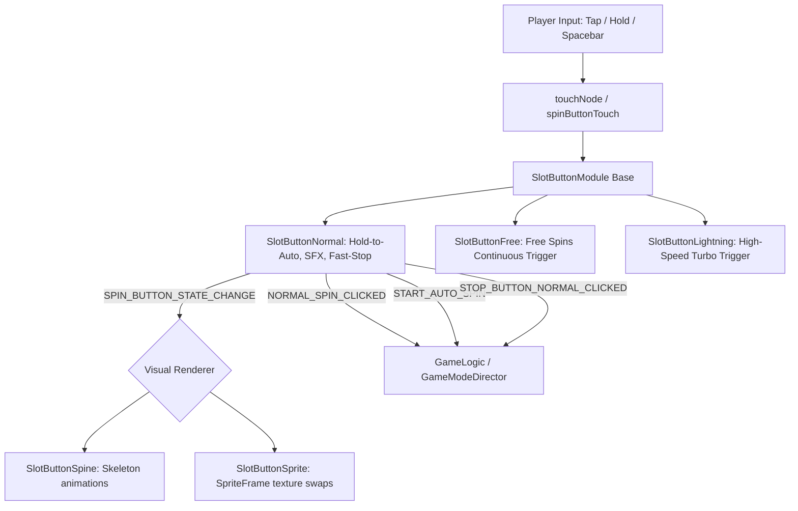

# 🏛️ SlotButtonModule Architectural Role & Complete Spin Input Ecosystem

<!-- convention-summary-start -->
### SlotButtonModule Architectural Role & Complete Spin Input Ecosystem Summary

- **Core Architecture / Purpose**: Technical reference, API contract, and integration guide for SlotButtonModule Architectural Role & Complete Spin Input Ecosystem.
- **Key Mechanisms & Design**: Encapsulates core algorithms, event hooks, and performance optimizations within the slot framework runtime.
- **Domain Capabilities**: cc_slot_module, 01_overview
- **Scope & Code Paths**: `assets/cc-common/cc-slot-module/`
- **Related Docs**: [Master Index](../INDEX.md)
<!-- convention-summary-end -->

---

## 1. Architectural Mission

The **Spin Button Ecosystem** is the fundamental user input gateway in every Cocos Creator slot game. It bridges physical player interactions (mouse hover, touch taps, $0.7\text{s}$ hold gestures, desktop Spacebar keypresses) with reactive game data streams (`buttonModel`) and dynamic animation renderers (`SlotButtonSpine` / `SlotButtonSprite`).

---

## 2. Comprehensive Class Anatomy

1. **`SlotButtonModule` (Base Component)**:
   - Manages generic registration with Director (`GameUIEvents.SPIN_BUTTON.SET_UP_BUTTON`), global keyboard Spacebar routing (`cc.systemEvent.on(KEY_UP)`), and input blocking via `UIManagerModule.checkDisplayPopup()`.
2. **`SlotButtonNormal` (Base Game Spin Button)**:
   - Handles base game spins, $0.7\text{s}$ hold-to-auto-spin countdown (`holdAction`), sound effects (`sfxSpinId`), text sprite swaps (`textHoldToAuto` $\leftrightarrow$ `textPressToStop`), mode transition locking (`_isSwitchingMode`), and promotional campaign overrides (`hasPromotion`).
3. **`SlotButtonFree` (Free Spins Button)**:
   - Dedicated component for Free Spins mode; dispatches `FREE_SPIN_CLICKED` on touch start and sets auto-spin flags.
4. **`SlotButtonLightning` (Lightning / Turbo Mode Button)**:
   - Dedicated component for high-speed turbo modes; dispatches `LIGHTNING_SPIN_CLICKED`.
5. **`SlotButtonSpine` (Skeleton Animation View Component)**:
   - Listens to `SPIN_BUTTON_STATE_CHANGE` and plays Spine tracks: `animIdle` ("Spin"), `animStop` ("Stop"), `animHover` ("Hover"), `animSpinToStop` ("Spin_To_Stop"). Handles `isResume` reconnect logic.
6. **`SlotButtonSprite` (2D Texture View Component)**:
   - Alternative lightweight 2D renderer that swaps `cc.SpriteFrame` textures for `normal`, `pressed`, `hover`, `disabled`, `stopNormal`, `stopHover`, and `stopPress`.
