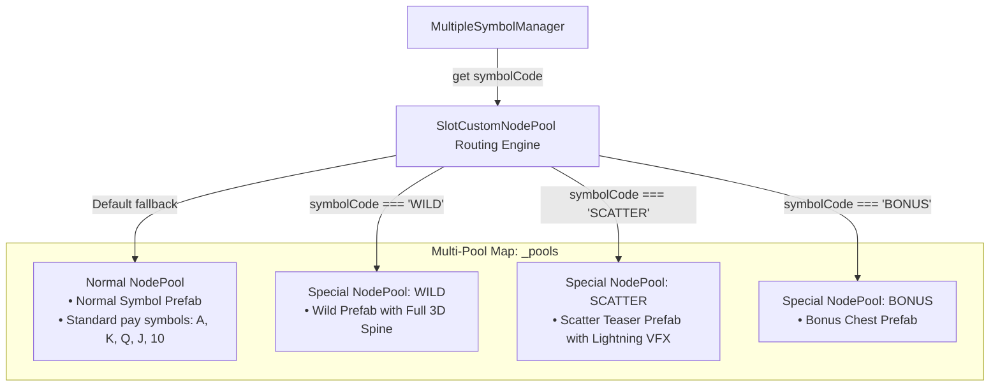

# 🏊 SlotCustomNodePool Heterogeneous Multi-Pool Architecture

<!-- convention-summary-start -->
### SlotCustomNodePool Heterogeneous Multi-Pool Architecture Summary

- **Core Architecture / Purpose**: Technical reference, API contract, and integration guide for SlotCustomNodePool Heterogeneous Multi-Pool Architecture.
- **Key Mechanisms & Design**: Encapsulates core algorithms, event hooks, and performance optimizations within the slot framework runtime.
- **Domain Capabilities**: cc_slot_module, 01_overview
- **Scope & Code Paths**: `SymbolPrefab.prefab`, `assets/cc-common/cc-slot-module/BaseModule/Table/SlotSymbol/SlotCustomNodePool.ts`
- **Related Docs**: [Master Index](../INDEX.md)
<!-- convention-summary-end -->

---

## 1. Architectural Purpose & Problem Statement

In slot titles with complex visual hierarchies (e.g. 3D Spines for Wilds, Dragon Scatter animations, separate Jackpot card templates), a single uniform symbol prefab (`SymbolPrefab.prefab`) is insufficient.

`SlotCustomNodePool` (`assets/cc-common/cc-slot-module/BaseModule/Table/SlotSymbol/SlotCustomNodePool.ts`) is a **Heterogeneous Multi-Pool Manager**. It encapsulates a `Map<string, cc.NodePool>` that routes symbol allocations and recycling across multiple distinct prefab templates based on `symbolCode`:

---

## 2. Core Responsibilities

1. **Multi-Template Pool Orchestration (`initSymbolPool`)**: Instantiates normal and special symbol pools using `SpecialSymbolTemplates` configurations.
2. **Metadata Tagging (`setNodeMetadata`)**: Injects metadata keys into allocated nodes:
   - `node['__custom_pool_name_'] = poolName` (Guarantees correct routing upon recycling).
   - `node[SPECIAL_SYMBOL_KEY] = isSpecial` (Protects persistent Spine skeleton data).
3. **Safe Dynamic Fallback (`getSymbolFromPool`)**: If a pool is exhausted, dynamically instantiates the correct template prefab without dropping frames.
4. **Origin-Aware Node Return (`put`)**: Inspects `node['__custom_pool_name_']` and returns the node to its exact origin pool in the map.
