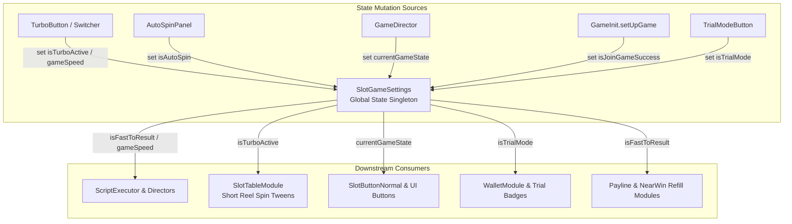

# 🏛️ SlotGameSettings Runtime Preferences & State Coordination Architecture

<!-- convention-summary-start -->
### SlotGameSettings Runtime Preferences & State Coordination Architecture Summary

- **Core Architecture / Purpose**: Technical reference, API contract, and integration guide for SlotGameSettings Runtime Preferences & State Coordination Architecture.
- **Key Mechanisms & Design**: Encapsulates core algorithms, event hooks, and performance optimizations within the slot framework runtime.
- **Domain Capabilities**: cc_slot_module, 01_overview
- **Scope & Code Paths**: `assets/cc-common/cc-slot-module/Core/SlotGameSettings.ts`
- **Related Docs**: [Master Index](../INDEX.md)
<!-- convention-summary-end -->

## 1. Executive Summary & Purpose

`SlotGameSettings` (`assets/cc-common/cc-slot-module/Core/SlotGameSettings.ts`) is the **Global Runtime Preferences & Game State Registry** in the `cc-common` Slot SDK.

Instantiated and registered into the IoC container by `GameInit`, `SlotGameSettings` acts as the single source of truth for **Turbo Mode** (`isTurboActive`), **Fast-To-Result (FTR)** (`isFastToResult`), **Auto-Spin** (`isAutoSpin`), **Trial Mode** (`isTrialMode`), and the overarching **State Machine Phase** (`currentGameState`).

---

## 2. Core Responsibilities

1. **Turbo & FTR Speed Regulation**: Provides `gameSpeed` (`NORMAL`, `TURBO`, `INSTANTLY`) and computed `isFastToResult` to bypass or shorten tween durations.
2. **State Machine Phase Broadcasting**: Stores `currentGameState` (`IDLE`, `SPINNING`, `WIN_EFFECT`, `TRANSITION`) enabling UI controls to dynamically lock/unlock.
3. **Session Context Integrity**: Holds `isJoinGameSuccess` to ensure player interaction is barred until the socket auth handshake finishes.
4. **Auto-Spin Loop Continuity**: Retains `isAutoSpin` flag so directors know to re-trigger spin sequences upon settlement.
