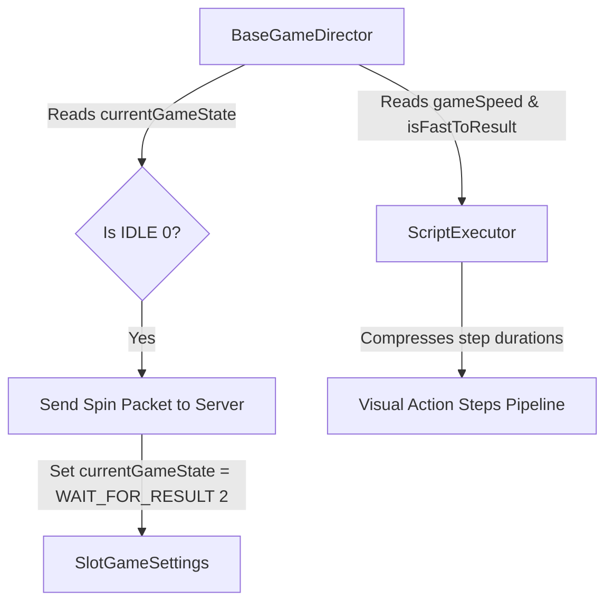

# 🎼 SlotGameSettings Pipeline Orchestration Across Directors

<!-- convention-summary-start -->
### SlotGameSettings Pipeline Orchestration Across Directors Summary

- **Core Architecture / Purpose**: Technical reference, API contract, and integration guide for SlotGameSettings Pipeline Orchestration Across Directors.
- **Key Mechanisms & Design**: Encapsulates core algorithms, event hooks, and performance optimizations within the slot framework runtime.
- **Domain Capabilities**: cc_slot_module, 03_director_writer_integration
- **Scope & Code Paths**: `assets/cc-common/cc-slot-module/`
- **Related Docs**: [Master Index](../INDEX.md)
<!-- convention-summary-end -->

## 1. Director Integration Architecture

Every mode director (`BaseGameDirector`, `FreeGameDirectorModule`, `BonusGameDirectorModule`) injects `SlotGameSettings` to govern the spin sequence pipeline:

---

## 2. Dynamic Delay Scaling in `ScriptExecutor`

When `ScriptExecutor` runs action steps, delay durations are mathematically adjusted by `SlotGameSettings.gameSpeed`:
* If `isFastToResult === true` ➔ Delays evaluate to `0ms`.
* If `isTurboActive === true` ➔ Delays are scaled by `0.5x`.
* Otherwise ➔ Delays run at normal `1.0x` speed.
