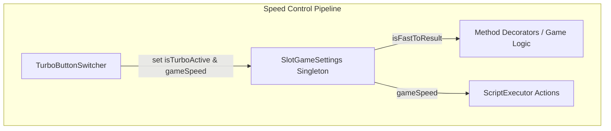

# 🏗️ SlotGameSettings Customization & Speed Control Guide

<!-- convention-summary-start -->
### SlotGameSettings Customization & Speed Control Guide Summary

- **Core Architecture / Purpose**: Technical reference, API contract, and integration guide for SlotGameSettings Customization & Speed Control Guide.
- **Key Mechanisms & Design**: Encapsulates core algorithms, event hooks, and performance optimizations within the slot framework runtime.
- **Domain Capabilities**: cc_slot_module, 09_inheritance_and_customization
- **Scope & Code Paths**: `assets/cc-common/cc-slot-module/`
- **Related Docs**: [Master Index](../INDEX.md)
<!-- convention-summary-end -->


## 1. Architectural Role: State Registry Singleton

`SlotGameSettings` is a pure TypeScript data container instantiated in `GameInit.onLoad()` and registered to the IoC container.

In typical slot titles, `SlotGameSettings` is used directly as a singleton service to share runtime flags (`isTurboActive`, `isFastToResult`, `isAutoSpin`, `currentGameState`).



---

## 2. When & How to Extend `SlotGameSettings`

If a new slot game introduces game-specific speed modes or state properties (such as `isSuperTurboActive`, `isGambleMode`, or `streakCount`):
1. Create a subclass extending `SlotGameSettings`.
2. Override `GameInit.setupDependencyInjection()` to provide your subclass under the `SlotGameSettings` token:
   ```typescript
   const customSettings = new SlotGameSettings9666();
   provide(SlotGameSettings, customSettings, gameId);
   ```
3. Use the `@inject(SlotGameSettings)` decorator in child components to access the extended properties.
