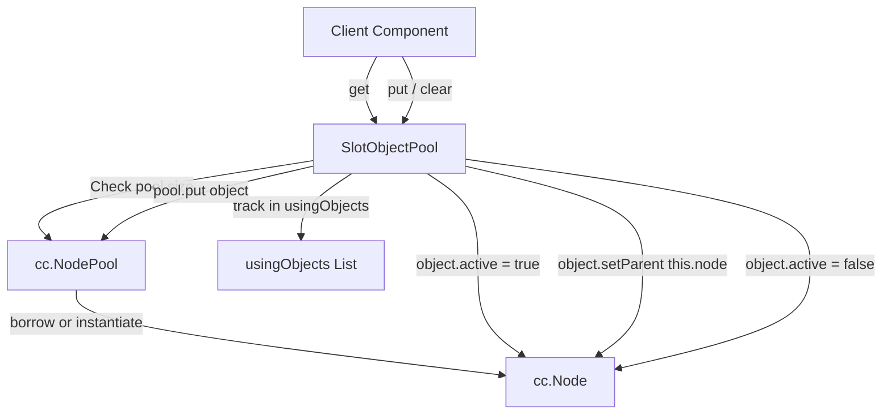

# 🏛️ SlotObjectPool Architectural Role & Scoped Node Pool

<!-- convention-summary-start -->
### SlotObjectPool Architectural Role & Scoped Node Pool Summary

- **Core Architecture / Purpose**: Technical reference, API contract, and integration guide for SlotObjectPool Architectural Role & Scoped Node Pool.
- **Key Mechanisms & Design**: Encapsulates core algorithms, event hooks, and performance optimizations within the slot framework runtime.
- **Domain Capabilities**: cc_slot_module, 01_overview
- **Scope & Code Paths**: `assets/cc-common/cc-slot-module/`
- **Related Docs**: [Master Index](../INDEX.md)
<!-- convention-summary-end -->

---

## 1. Architectural Mission

`SlotObjectPool` is an alternative component-scoped object pooling controller designed for scene-bound visual elements (such as win lines, highlight boxes, floating score numbers). Unlike `PoolFactoryModule`, `SlotObjectPool` automatically assigns borrowed nodes to its host node (`object.setParent(this.node)`) and manages their active visibility state (`object.active = true/false`) during checkout (`get()`) and return (`put()`).

---

## 2. Key Responsibilities

1. **Automatic Parent Attachment**:
   - Automatically attaches checked-out nodes to `this.node` and sets `object.active = true`.
2. **Active State Management**:
   - Deactivates nodes (`object.active = false`) upon recycling before placing them into the internal `cc.NodePool`.
3. **Safe Validation**:
   - Utilizes `cc.isValid` guards on both the pool host and recycled nodes to prevent illegal pool operations on destroyed components.
