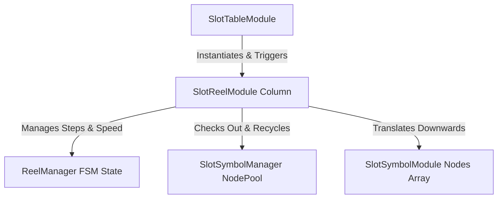

# 🎰 SlotReelModule Architectural Role & Column Physics

<!-- convention-summary-start -->
### SlotReelModule Architectural Role & Column Physics Summary

- **Core Architecture / Purpose**: Technical reference, API contract, and integration guide for SlotReelModule Architectural Role & Column Physics.
- **Key Mechanisms & Design**: Encapsulates core algorithms, event hooks, and performance optimizations within the slot framework runtime.
- **Domain Capabilities**: cc_slot_module, 01_overview
- **Scope & Code Paths**: `assets/cc-common/cc-slot-module/BaseModule/Table/SlotTable/scripts/SlotReelModule.ts`
- **Related Docs**: [Master Index](../INDEX.md)
<!-- convention-summary-end -->

---

## 1. Architectural Purpose & System Boundary

`SlotReelModule` (`assets/cc-common/cc-slot-module/BaseModule/Table/SlotTable/scripts/SlotReelModule.ts`) is the **Single Column Reel Scrolling Engine** in the `cc-common` Slot Framework.

Extending `cc.Component` and implementing `IReelComponent`, each reel instance is dynamically spawned and managed by `SlotTableModule`. It coordinates vertical pixel translation, continuous symbol recycling during rolling, buffer boundary wrapping, near-win anticipation extensions, and bounce-landing easing animations (`easeBackOut`).

---

## 2. Core Responsibilities

1. **Reel FSM Lifecycle (`ReelManager`)**: Manages 4 states (`IDLE`, `START`, `SHOWING_RESULT`, `STOPPED`).
2. **Infinite Wrapping & Recycling (`recycleSymbol` & `spawnReelSymbol`)**: Pops symbols scrolling beyond the bottom buffer and instantiates/recycles new symbols at the top buffer.
3. **Landing Physics (`playStopAnimation`)**: Executes two-phase bounce overshoot and landing easing (`getPositionStopStep()`).
4. **Anticipation Extension (`extendTimeToStop`)**: Delays column deceleration for near-win scatter tension.
5. **Symbol Grid Extraction (`getRealSymbols`, `getSymbolByRow`)**: Filters out offscreen top/bottom buffer rows to provide clean visible symbol node references.
