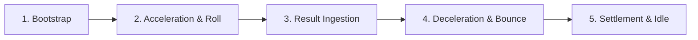

# 🔄 SlotReelModule Spin Phase Breakdown

<!-- convention-summary-start -->
### SlotReelModule Spin Phase Breakdown Summary

- **Core Architecture / Purpose**: Defines network protocol, socket packet lifecycle, state persistence, and error handling for SlotReelModule Spin Phase Breakdown.
- **Key Mechanisms & Design**: Handles WebSocket frame dispatch, acknowledgment confirmation, state resume, and resilient synchronization between client DataStore and Backend Gateway.
- **Domain Capabilities**: cc_slot_module, 02_game_flow
- **Scope & Code Paths**: `assets/cc-common/cc-slot-module/`
- **Related Docs**: [Master Index](../INDEX.md)
<!-- convention-summary-end -->

---

## 1. The 5 Spin Loop Phases in a Single Column

---

## 2. Phase 1: Bootstrap & Layout (`initReel`)
* Instantiates `ReelManager` calculating `totalSymbol = visibleSymbol + BUFFER_TOP + BUFFER_BOT`.
* Spawns initial static symbols at pre-computed grid positions (`initPositionByType()`).
* Saves baseline node anchor: `this.originalPosition = new cc.Vec2(this.node.position.x, this.node.position.y)`.

---

## 3. Phase 2: Start Spin & Rolling (`runReelSpin`)
* Sets state to `ReelSpinState.START`.
* Enters continuous tween loop: `this.node.position.y -= this.SYMBOL_HEIGHT`.
* On each step completion, calls `recycleSymbol()`: removes bottom symbol and spawns new random blur symbol at `topY`.

---

## 4. Phase 3: Server Result Population (`showResult`)
* Ingests target column symbols, prepending bottom buffers and appending top buffers: `updateReelResult(symbols)`.
* Schedules step countdown timer (`setUpStopCallback()`).
* As steps decrement below `totalSymbol`, transitions to `ReelSpinState.SHOWING_RESULT` and spawns server target symbols.

---

## 5. Phase 4: Deceleration & Bounce Animation (`playStopAnimation`)
* Invokes pre-stop notification: `onReelPreStop()` ➔ triggers near-win sound / VFX if applicable.
* Executes two-phase bounce tween:
  1. Downward overshoot: `by(spinSpeed, { position: (0, -easingStop) })`.
  2. Upward rebound settling: `by(spinSpeed, { position: (0, easingStop) })`.

---

## 6. Phase 5: Reel Reset & Teardown (`resetReel`)
* Recalculates symbol local positions minus accumulated offset.
* Snaps column container back to `this.originalPosition`.
* Hides offscreen fake top/bottom buffer symbols: `hideFakeSymbols()`.
* Invokes `reelStopCB(this.reelIndex)` to notify parent table that this column has completely settled.
