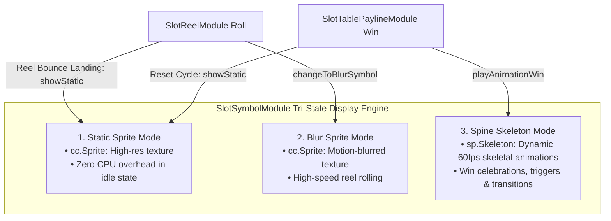

# 🎰 SlotSymbolModule Visual Entity Architecture & Display Tri-State

<!-- convention-summary-start -->
### SlotSymbolModule Visual Entity Architecture & Display Tri-State Summary

- **Core Architecture / Purpose**: Technical reference, API contract, and integration guide for SlotSymbolModule Visual Entity Architecture & Display Tri-State.
- **Key Mechanisms & Design**: Encapsulates core algorithms, event hooks, and performance optimizations within the slot framework runtime.
- **Domain Capabilities**: cc_slot_module, 01_overview
- **Scope & Code Paths**: `assets/cc-common/cc-slot-module/BaseModule/Table/SlotSymbol/SlotSymbolModule.ts`
- **Related Docs**: [Master Index](../INDEX.md)
<!-- convention-summary-end -->

---

## 1. Architectural Purpose & Entity Boundary

`SlotSymbolModule` (`assets/cc-common/cc-slot-module/BaseModule/Table/SlotSymbol/SlotSymbolModule.ts`) is the **Universal Visual Symbol Entity** in the `cc-common` Slot Framework.

Attached to every symbol node instantiated by `SlotSymbolManager` or `SlotReelModule`, it encapsulates the complete visual lifecycle of a grid cell. It operates across **3 distinct rendering modes (Tri-State Display Engine)**:

---

## 2. Core Responsibilities

1. **Display State Switching (`switchToStatic`)**: Toggles visibility between static `cc.Sprite` and `sp.Skeleton` components without destroying nodes.
2. **Resource Fetching via `SlotSymbolResourceManager`**: Pulls sprite frames, blur textures, and Spine skeleton data dynamically by symbol code (e.g. `"K1"`, `"WILD"`, `"SCATTER"`).
3. **Multi-Cell Grid Dimension Support (`mapSymbolData`, `size`)**: Parses composite strings (e.g. `"WILD_1_3"`) for $1\times 2$, $1\times 3$, or $2\times 2$ Mega Symbols.
4. **Payline Dimming & Highlighting (`enableHighlight`, `disableHighlight`)**: Modifies renderer vertex colors (`cc.Color`) for non-winning dimmed symbols.
5. **Zero-Allocation Node Pooling Lifecycle (`resetBeforeBackToPool`, `clearSkeletonData`)**: Flushes skeleton data and restores resting state before returning to `SlotSymbolManager`.
