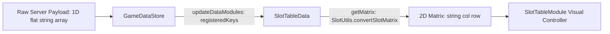

# 📊 SlotTableData Architectural Role & Matrix Conversion

<!-- convention-summary-start -->
### SlotTableData Architectural Role & Matrix Conversion Summary

- **Core Architecture / Purpose**: Technical reference, API contract, and integration guide for SlotTableData Architectural Role & Matrix Conversion.
- **Key Mechanisms & Design**: Encapsulates core algorithms, event hooks, and performance optimizations within the slot framework runtime.
- **Domain Capabilities**: cc_slot_module, 01_overview
- **Scope & Code Paths**: `assets/cc-common/cc-slot-module/BaseModule/Table/SlotTable/scripts/SlotTableData.ts`
- **Related Docs**: [Master Index](../INDEX.md)
<!-- convention-summary-end -->

---

## 1. Architectural Purpose & Role

`SlotTableData` (`assets/cc-common/cc-slot-module/BaseModule/Table/SlotTable/scripts/SlotTableData.ts`) is the **Reactive Data Model** companion for `SlotTableModule`.

Extending `BaseDataModule`, it registers tracked state keys (`registeredKeys = ["matrix0", "matrix", "normalGameMatrix", "freeGameMatrix"]`) to automatically ingest raw server matrix payloads from `GameDataStore`. It transforms flat 1D string arrays into normalized 2D column-major matrices (`string[][]`) based on the table geometry defined in `TableModuleConfig.TABLE_FORMAT`.

---

## 2. Core Responsibilities

1. **Reactive State Ingestion**: Automatically listens to `"matrix0"`, `"matrix"`, `"normalGameMatrix"`, `"freeGameMatrix"` slices from `GameDataStore`.
2. **Matrix Format Transformation (`getMatrix`)**: Uses `eno.SlotUtils.convertSlotMatrix` to shape 1D array into `[col][row]` array matching `TABLE_FORMAT`.
3. **Mode-Specific Matrix Retrieval (`getRawMatrix`, `getRawResumeMatrix`)**: Differentiates between Normal Game and Free Game mode matrices.
4. **Reconnection State Recovery (`getResumeMatrix`)**: Restores and caches the saved matrix state upon browser refresh or network reconnection.
