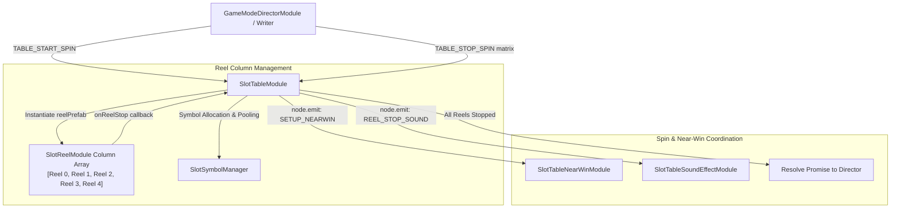

# 🏛️ SlotTableModule Matrix & Reel Table Engine Architecture

<!-- convention-summary-start -->
### SlotTableModule Matrix & Reel Table Engine Architecture Summary

- **Core Architecture / Purpose**: Technical reference, API contract, and integration guide for SlotTableModule Matrix & Reel Table Engine Architecture.
- **Key Mechanisms & Design**: Encapsulates core algorithms, event hooks, and performance optimizations within the slot framework runtime.
- **Domain Capabilities**: cc_slot_module, 01_overview
- **Scope & Code Paths**: `assets/cc-common/cc-slot-module/BaseModule/Table/SlotTable/scripts/SlotTableModule.ts`
- **Related Docs**: [Master Index](../INDEX.md)
<!-- convention-summary-end -->

## 1. Executive Summary & Purpose

`SlotTableModule` (`assets/cc-common/cc-slot-module/BaseModule/Table/SlotTable/scripts/SlotTableModule.ts`) is the **Master Table Grid Orchestrator** in the `cc-common` Slot SDK.

Extending `SlotBaseModule`, it dynamically instantiates and manages the column reels (`reelPrefab`), routes spinning lifecycle commands (`TABLE_START_SPIN`, `TABLE_STOP_SPIN`, `TABLE_FAST_STOP`), interfaces with `SlotSymbolManager` for symbol recycling, controls Near-Win anticipation VFX (`SETUP_NEARWIN`), and returns a unified async `Promise` when all columns complete their deceleration bounce.

---

## 2. Core Responsibilities

1. **Dynamic Reel Grid Instantiation (`initTable`)**: Computes centering offsets (`START_X`) based on `TOTAL_COLS` and `SYMBOL_WIDTH`, instantiating `SlotReelModule` child columns.
2. **Spin Execution & Mode Delegation (`startSpin`)**: Queries `gameSettings.isTurboActive` to select `NORMAL` vs `TURBO` easing configs and starts all column reels.
3. **Matrix Result Ingestion & Sequential Stopping (`stopSpin`)**: Ingests the server's 2D symbol matrix (`string[][]`), delegates column data to `reelComponent.showResult()`, and returns a single `Promise<void>` that resolves when `reelCount >= reels.length`.
4. **Fast-Stop Acceleration (`fastStop`)**: Shortens deceleration bounce curves across all spinning reels when the player taps the screen.
5. **State Tracking**: Manages `TableSpinState` transitions (`READY`, `START`, `SHOWING_RESULT`, `STOPPING_IMMEDIATELY`, `STOPPED`).
