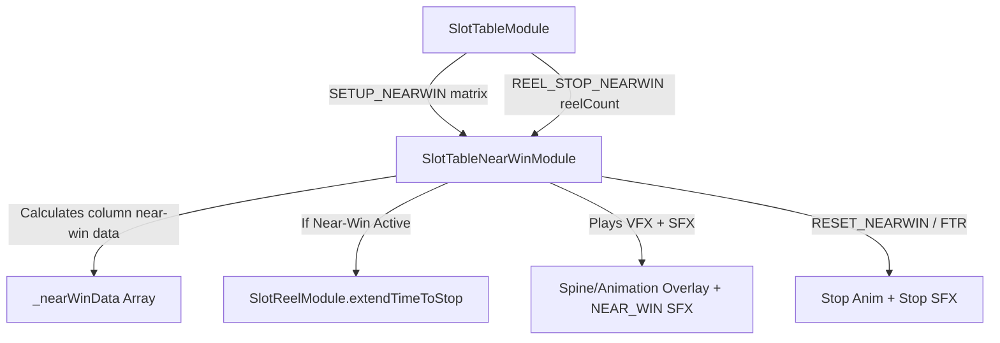

# 🎭 SlotTableNearWinModule Architecture & Role

<!-- convention-summary-start -->
### SlotTableNearWinModule Architecture & Role Summary

- **Core Architecture / Purpose**: Technical reference, API contract, and integration guide for SlotTableNearWinModule Architecture & Role.
- **Key Mechanisms & Design**: Encapsulates core algorithms, event hooks, and performance optimizations within the slot framework runtime.
- **Domain Capabilities**: cc_slot_module, 01_overview
- **Scope & Code Paths**: `assets/cc-common/cc-slot-module/BaseModule/Table/SlotTable/scripts/SlotTableNearWinModule.ts`
- **Related Docs**: [Master Index](../INDEX.md)
<!-- convention-summary-end -->

---

## 1. Architectural Purpose

`SlotTableNearWinModule` (`assets/cc-common/cc-slot-module/BaseModule/Table/SlotTable/scripts/SlotTableNearWinModule.ts`) is the anticipation VFX and tension choreography engine of the Slot Table subsystem.

When a spin matrix contains sufficient trigger symbols (e.g. 2 Scatters on Reels 1 and 3, needing 1 more on Reel 5 to enter Free Games), `SlotTableNearWinModule`:
1. Pre-calculates near-win conditions across columns during `SETUP_NEARWIN`.
2. Extends the spin roll duration on the pending anticipation column (`extendTimeToStop`).
3. Positions and activates the anticipation glow overlay (`nearWinEffect` Spine / Animation).
4. Loops tension SFX (`NEAR_WIN`) via `SlotSoundPlayerModule`.
5. Cleans up effects smoothly upon reel stop or instantly during Fast-To-Result (FTR).

---

## 2. Core Responsibilities

1. **Matrix Anticipation Parsing**: Evaluates Scatter, Bonus, and Jackpot counts column-by-column before reels stop.
2. **Reel Duration Extension**: Flags the target reel column to extend its spin cycle, heightening player suspense.
3. **Dynamic VFX Positioning**: Repositions the anticipation highlight node (`nearWinEffect`) along the X-axis (`_getXPosition(col)`).
4. **Audio Choreography Integration**: Triggers and halts looping tension SFX synchronously with visual animations.
