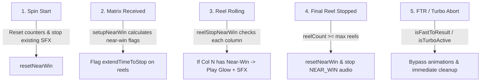

# 🌀 SlotTableNearWinModule Spin Phase Breakdown

<!-- convention-summary-start -->
### SlotTableNearWinModule Spin Phase Breakdown Summary

- **Core Architecture / Purpose**: Defines network protocol, socket packet lifecycle, state persistence, and error handling for SlotTableNearWinModule Spin Phase Breakdown.
- **Key Mechanisms & Design**: Handles WebSocket frame dispatch, acknowledgment confirmation, state resume, and resilient synchronization between client DataStore and Backend Gateway.
- **Domain Capabilities**: cc_slot_module, 02_game_flow
- **Scope & Code Paths**: `assets/cc-common/cc-slot-module/`
- **Related Docs**: [Master Index](../INDEX.md)
<!-- convention-summary-end -->

---

## 1. Spin Phase Matrix Behavior

---

## 2. Granular Behavior Breakdown

1. **Pre-Spin & Spin Start**:
   - `SlotTableModule` clears any residual visual states.
   - `SlotTableNearWinModule` listens to `RESET_NEARWIN` and zeroes `_countScatter`, `_countBonus`, and `_countJp`.
2. **Server Matrix Ingestion**:
   - As server data arrives, `setupNearWin` iterates columns `0..N`.
   - If count meets or exceeds `startAtScatterCount` / `startAtBonusCount`, subsequent columns are marked with `isNearWin: true`.
   - Calls `context.reels[col].extendTimeToStop(true, isLastCol)` on the upcoming reel.
3. **Sequential Reel Landing**:
   - When reel `k` stops, `SlotTableModule` emits `REEL_STOP_NEARWIN`.
   - If reel `k+1` is in anticipation, `_playNearWinEffect(k+1)` sets position to `_getXPosition(k+1)` and starts looping tension audio.
4. **Conclusion or Fast Stop**:
   - When all reels land or player triggers Fast Stop (FTR), `resetNearWin()` stops Spine animations, hides the overlay node, and stops audio.
