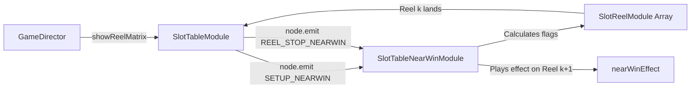

# 🎼 SlotTableNearWinModule Pipeline Orchestration

<!-- convention-summary-start -->
### SlotTableNearWinModule Pipeline Orchestration Summary

- **Core Architecture / Purpose**: Technical reference, API contract, and integration guide for SlotTableNearWinModule Pipeline Orchestration.
- **Key Mechanisms & Design**: Encapsulates core algorithms, event hooks, and performance optimizations within the slot framework runtime.
- **Domain Capabilities**: cc_slot_module, 03_director_writer_integration
- **Scope & Code Paths**: `assets/cc-common/cc-slot-module/`
- **Related Docs**: [Master Index](../INDEX.md)
<!-- convention-summary-end -->

---

## 1. Interaction Pipeline

`SlotTableNearWinModule` acts as an event-driven slave to `SlotTableModule`. When Writer/Director commands trigger reel stops, the pipeline proceeds as follows:

---

## 2. Writer Integration Points

1. **`makeScriptStopTable`**: Writer dispatches table stop command. `SlotTableModule` executes reel deceleration, firing `REEL_STOP_NEARWIN` after each reel reaches standstill.
2. **Fast-To-Result (FTR) Abort**: When player clicks Fast Stop, the Director accelerates the action queue, calling `isFastToResult()` which skips subsequent anticipation animations.
