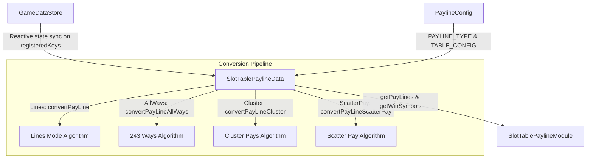

# 🏛️ SlotTablePaylineData Architecture & Role

<!-- convention-summary-start -->
### SlotTablePaylineData Architecture & Role Summary

- **Core Architecture / Purpose**: Technical reference, API contract, and integration guide for SlotTablePaylineData Architecture & Role.
- **Key Mechanisms & Design**: Encapsulates core algorithms, event hooks, and performance optimizations within the slot framework runtime.
- **Domain Capabilities**: cc_slot_module, 01_overview
- **Scope & Code Paths**: `assets/cc-common/cc-slot-module/BaseModule/Payline/PaylineModule/scripts/SlotTablePaylineData.ts`
- **Related Docs**: [Master Index](../INDEX.md)
<!-- convention-summary-end -->

---

## 1. Architectural Purpose

`SlotTablePaylineData` (`assets/cc-common/cc-slot-module/BaseModule/Payline/PaylineModule/scripts/SlotTablePaylineData.ts`) is the **Reactive Payline Data Model** in the `cc-common` Slot SDK.

Extending `BaseDataModule`, it observes reactive store keys (`payLines`, `matrix`, `respinGamePayLines`, `jackpotPayline`) and converts raw backend string arrays into structured geometric coordinate tracks consumable by the visual presentation layer (`SlotTablePaylineModule`).

---

## 2. Core Responsibilities

1. **Reactive Key Subscription**: Listens to 15 state keys (`registeredKeys: ['state', 'isResume', 'matrix', 'payLines', 'rightPayLines', ...]`).
2. **Mode-Aware Selection**: Selects normal, free, or respin matrices and paylines depending on `state` and `isResume`.
3. **Multi-System Conversion (`convertPayLine`)**: Translates paylines according to `PAYLINE_TYPE` (Lines, AllWays, Cluster, ScatterPay).
4. **Jackpot Payline Extraction (`getJackpotPayline`)**: Parses backend delimited jackpot payloads (`"ID;WinNumbers;WinAmount"`).
5. **Bidirectional Support (`rightPayLines`)**: Flags and converts Both-Ways / Right-to-Left paylines (`isRight: true`).
