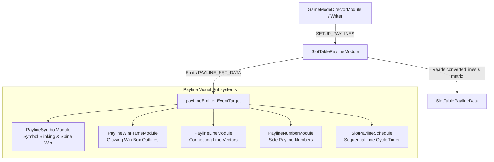

# 🏛️ SlotTablePaylineModule Architecture & Role

<!-- convention-summary-start -->
### SlotTablePaylineModule Architecture & Role Summary

- **Core Architecture / Purpose**: Technical reference, API contract, and integration guide for SlotTablePaylineModule Architecture & Role.
- **Key Mechanisms & Design**: Encapsulates core algorithms, event hooks, and performance optimizations within the slot framework runtime.
- **Domain Capabilities**: cc_slot_module, 01_overview
- **Scope & Code Paths**: `assets/cc-common/cc-slot-module/BaseModule/Payline/PaylineModule/scripts/SlotTablePaylineModule.ts`
- **Related Docs**: [Master Index](../INDEX.md)
<!-- convention-summary-end -->

---

## 1. Architectural Purpose

`SlotTablePaylineModule` (`assets/cc-common/cc-slot-module/BaseModule/Payline/PaylineModule/scripts/SlotTablePaylineModule.ts`) is the **Master Win Presentation & Payline Controller** in the `cc-common` Slot SDK.

When a spin results in a payout, `SlotTablePaylineModule`:
1. Receives the `SETUP_PAYLINES` command from Director/Writer pipelines.
2. Ingests normalized payline results from `SlotTablePaylineData`.
3. Coordinates all child payline visualization components (`PaylineSymbolModule`, `PaylineWinFrameModule`, `PaylineLineModule`, `PaylineNumberModule`) via an internal `payLineEmitter` event bus.
4. Executes the two-stage presentation lifecycle:
   - **Stage 1 (Show All)**: Concurrently blinks/highlights all winning symbols across all hit lines.
   - **Stage 2 (Sequential Cycling)**: Delegates to `SlotPaylineSchedule` to cycle sequentially line-by-line while player is idle.

---

## 2. Core Responsibilities

1. **Subsystem Initialization (`init`)**: Discovers all `BasePaylineComponent` children, passes `PaylineConfig` and `payLineEmitter`, and binds lifecycle events.
2. **Data Propagation (`onSetupPaylines`)**: Fetches `matrix`, `payLines`, `winSymbols`, and `jackpotPayline` from `SlotTablePaylineData` and dispatches `PAYLINE_SET_DATA`.
3. **Dynamic Format Adaptation (`onTableFormatChanged`)**: Dynamically updates the grid format in `PaylineConfig` when expanding reels or shifting matrix sizes occur.
4. **Lifecycle & Memory Management**: Unbinds listeners in `onDestroy()` to prevent dangling references.
